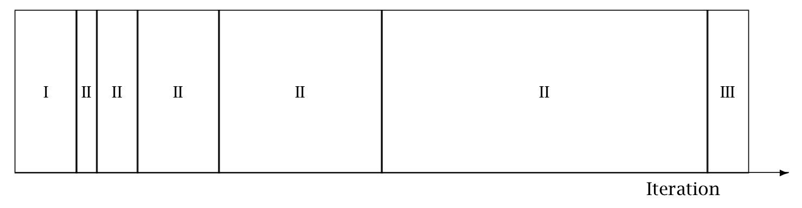

```{r include=FALSE, cache=FALSE}
library(ggplot2)
library(rstan)

set.seed(123454321)

options(digits = 3)

printf <- function(pattern, ...) {
  cat(sprintf(pattern, ...))
}

knitr::opts_chunk$set(
  comment = "#>",
  collapse = TRUE,
  cache = TRUE,
  out.width = "70%",
  fig.align = 'left',
  fig.width = 6,
  fig.asp = 0.618,  # 1 / phi
  fig.show = "hold"
)
```
```{r include=FALSE, cache=FALSE}
library(ggplot2)
library(rstan)

set.seed(123454321)

options(digits = 3)

printf <- function(pattern, ...) {
  cat(sprintf(pattern, ...))
}

knitr::opts_chunk$set(
  comment = "#>",
  collapse = TRUE,
  cache = TRUE,
  out.width = "70%",
  fig.align = 'left',
  fig.width = 6,
  fig.asp = 0.618,  # 1 / phi
  fig.show = "hold"
)
```
```{r include=FALSE, cache=FALSE}
library(ggplot2)
library(rstan)

set.seed(123454321)

options(digits = 3)

printf <- function(pattern, ...) {
  cat(sprintf(pattern, ...))
}

knitr::opts_chunk$set(
  comment = "#>",
  collapse = TRUE,
  cache = TRUE,
  out.width = "70%",
  fig.align = 'left',
  fig.width = 6,
  fig.asp = 0.618,  # 1 / phi
  fig.show = "hold"
)
```
```{r include=FALSE, cache=FALSE}
library(ggplot2)
library(rstan)

set.seed(123454321)

options(digits = 3)

printf <- function(pattern, ...) {
  cat(sprintf(pattern, ...))
}

knitr::opts_chunk$set(
  comment = "#>",
  collapse = TRUE,
  cache = TRUE,
  out.width = "70%",
  fig.align = 'left',
  fig.width = 6,
  fig.asp = 0.618,  # 1 / phi
  fig.show = "hold"
)
```
```{r include=FALSE, cache=FALSE}
library(ggplot2)
library(rstan)

set.seed(123454321)

options(digits = 3)

printf <- function(pattern, ...) {
  cat(sprintf(pattern, ...))
}

knitr::opts_chunk$set(
  comment = "#>",
  collapse = TRUE,
  cache = TRUE,
  out.width = "70%",
  fig.align = 'left',
  fig.width = 6,
  fig.asp = 0.618,  # 1 / phi
  fig.show = "hold"
)
```
```{r include=FALSE, cache=FALSE}
library(ggplot2)
library(rstan)

set.seed(10101010)

options(digits = 3)

printf <- function(pattern, ...) {
  cat(sprintf(pattern, ...))
}

knitr::opts_chunk$set(
  comment = "#>",
  collapse = TRUE,
  cache = TRUE,
  out.width = "70%",
  fig.align = 'left',
  fig.width = 6,
  fig.asp = 0.618,  # 1 / phi
  fig.show = "hold"
)
```
# MCMC Sampling {#hmc.chapter} 

This chapter presents the two Markov chain Monte Carlo (MCMC)
algorithms used in Stan, the Hamiltonian Monte Carlo (HMC) algorithm
and its adaptive variant the no-U-turn sampler (NUTS), along with
details of their implementation and configuration.


## Hamiltonian Monte Carlo

Hamiltonian Monte Carlo (HMC) is a Markov chain Monte Carlo (MCMC)
method that uses the derivatives of the density function being sampled
to generate efficient transitions spanning the posterior (see, e.g.,
@Betancourt-Girolami:2013, @Neal:2011 for more details). It uses an
approximate Hamiltonian dynamics simulation based on numerical
integration which is then corrected by performing a Metropolis
acceptance step.

This section translates the presentation of HMC by
@Betancourt-Girolami:2013 into the notation of @GelmanEtAl:2013.


### Target Density {-}

The goal of sampling is to draw from a density $p(\theta)$ for
parameters $\theta$.  This is typically a Bayesian posterior
$p(\theta|y)$ given data $y$, and in particular, a Bayesian posterior
coded as a Stan program.


### Auxiliary Momentum Variable {-}

HMC introduces auxiliary momentum variables $\rho$ and draws from a
joint density

$$
p(\rho, \theta) = p(\rho | \theta) p(\theta).
$$

In most applications of HMC, including Stan, the auxiliary density is
a multivariate normal that does not depend on the parameters $\theta$,

$$
\rho \sim \mathsf{MultiNormal}(0, \Sigma).
$$

The covariance matrix $\Sigma$ acts as a Euclidean metric to rotate
and scale the target distribution; see @Betancourt-Stein:2011 for
details of the geometry.

In Stan, this matrix may be set to the identity matrix (i.e., unit
diagonal) or estimated from warmup draws and optionally restricted to
a diagonal matrix. The inverse $\Sigma^{-1}$ is known as the mass
matrix, and will be a unit, diagonal, or dense if $\Sigma$ is.


### The Hamiltonian {-}

The joint density $p(\rho, \theta)$ defines a Hamiltonian

$$
\begin{array}{rcl}
H(\rho, \theta) & = & - \log p(\rho, \theta)
\\[3pt]
& = & - \log p(\rho | \theta) - \log p(\theta).
\\[3pt]
& = & T(\rho | \theta) + V(\theta),
\end{array}
$$

where the term

$$
T(\rho | \theta) = - \log p(\rho | \theta)
$$

is called the "kinetic energy" and the term

$$
V(\theta) = - \log p(\theta)
$$

is called the "potential energy."  The potential energy is specified
by the Stan program through its definition of a log density.


### Generating Transitions {-}

Starting from the current value of the parameters $\theta$, a
transition to a new state is generated in two stages before being
subjected to a Metropolis accept step.

First, a value for the momentum is drawn independently of the current
parameter values,

$$
\rho \sim \mathsf{MultiNormal}(0, \Sigma).
$$

Thus momentum does not persist across iterations.

Next, the joint system $(\theta,\rho)$ made up of the current
parameter values $\theta$ and new momentum $\rho$ is evolved via
Hamilton's equations,

$$
\begin{array}{rcccl}
\displaystyle
\frac{d\theta}{dt}
& = &
\displaystyle
+ \frac{\partial H}{\partial \rho}
& = &
\displaystyle
+ \frac{\partial T}{\partial \rho}
\\[12pt]
\displaystyle
\frac{d\rho}{dt}
& = &
\displaystyle
- \frac{\partial H}{\partial \theta }
& = &
\displaystyle
- \frac{\partial T}{\partial \theta}
- \frac{\partial V}{\partial \theta}.
\end{array}
$$

With the momentum density being independent of the target density,
i.e., $p(\rho | \theta) = p(\rho)$, the first term in the
momentum time derivative, ${\partial T} / {\partial \theta}$ is
zero, yielding the pair time derivatives

$$
\begin{array}{rcl}
\frac{d \theta}{d t} & = & +\frac{\partial T}{\partial \rho}
\\[2pt]
\frac{d \rho}{d t} & = & -\frac{\partial V}{\partial \theta}.
\end{array}
$$

### Leapfrog Integrator {-}

The last section leaves a two-state differential equation to solve.
Stan, like most other HMC implementations, uses the leapfrog
integrator, which is a numerical integration algorithm that's
specifically adapted to provide stable results for Hamiltonian systems
of equations.

Like most numerical integrators, the leapfrog algorithm takes discrete
steps of some small time interval $\epsilon$. The leapfrog algorithm
begins by drawing a fresh momentum term independently of the parameter
values $\theta$ or previous momentum value.

$$
\rho \sim \mathsf{MultiNormal}(0, \Sigma).
$$
It then alternates half-step updates of the momentum and full-step
updates of the position.

$$
\begin{array}{rcl}
\rho & \leftarrow
     & \rho \, - \, \frac{\epsilon}{2} \frac{\partial V}{\partial \theta}
\\[6pt]
\theta & \leftarrow
       & \theta \, + \, \epsilon \, \Sigma \, \rho
\\[6pt]
\rho & \leftarrow
     & \rho \, - \, \frac{\epsilon}{2} \frac{\partial V}{\partial \theta}.
\end{array}
$$

By applying $L$ leapfrog steps, a total of $L \, \epsilon$ time is
simulated. The resulting state at the end of the simulation ($L$
repetitions of the above three steps) will be denoted
$(\rho^{*}, \theta^{*})$.

The leapfrog integrator's error is on the order of $\epsilon^3$ per
step and $\epsilon^2$ globally, where $\epsilon$ is the time interval
(also known as the step size);  @LeimkuhlerReich:2004 provide a
detailed analysis of numerical integration for Hamiltonian systems,
including a derivation of the error bound for the leapfrog
integrator.


### Metropolis Accept Step {-}

If the leapfrog integrator were perfect numerically, there would no
need to do any more randomization per transition than generating a
random momentum vector. Instead, what is done in practice to account
for numerical errors during integration is to apply a Metropolis
acceptance step, where the probability of keeping the proposal
$(\rho^{*}, \theta^{*})$ generated by transitioning from
$(\rho, \theta)$ is

$$
\min \!
\left(
1,
\ \exp \! \left( H(\rho, \theta) - H(\rho^{*}, \theta^{*}) \right)
\right).
$$

If the proposal is not accepted, the previous parameter value is
returned for the next draw and used to initialize the next iteration.


### Algorithm Summary {-}

The Hamiltonian Monte Carlo algorithm starts at a specified initial
set of parameters $\theta$; in Stan, this value is either
user-specified or generated randomly. Then, for a given number of
iterations, a new momentum vector is sampled and the current value of
the parameter $\theta$ is updated using the leapfrog integrator with
discretization time $\epsilon$ and number of steps $L$ according to
the Hamiltonian dynamics. Then a Metropolis acceptance step is
applied, and a decision is made whether to update to the new state
$(\theta^{*}, \rho^{*})$ or keep the existing state.


## HMC Algorithm Parameters

The Hamiltonian Monte Carlo algorithm has three parameters which must
be set,

* discretization time $\epsilon$,
* mass matrix $\Sigma^{-1}$, and
* number of steps taken $L$.

In practice, sampling efficiency, both in terms of iteration speed and
iterations per effective sample, is highly sensitive to these three
tuning parameters @Neal:2011, @Hoffman-Gelman:2014.

If $\epsilon$ is too large, the leapfrog integrator will be inaccurate
and too many proposals will be rejected. If $\epsilon$ is too small,
too many small steps will be taken by the leapfrog integrator leading
to long simulation times per interval. Thus the goal is to balance the
acceptance rate between these extremes.

If $L$ is too small, the trajectory traced out in each iteration will
be too short and sampling will devolve to a random walk.  If $L$ is
too large, the algorithm will do too much work on each iteration.

If the mass matrix $\Sigma$ is poorly suited to the covariance of the
posterior, the step size $\epsilon$ will have to be decreased to
maintain arithmetic precision while at the same time, the number of
steps $L$ is increased in order to maintain simulation time to ensure
statistical efficiency.


### Integration Time {-}

The actual integration time is $L \, \epsilon$, a function of number
of steps.  Some interfaces to Stan set an approximate integration time
$t$ and the discretization interval (step size) $\epsilon$.  In these
cases, the number of steps will be rounded down as

$$
L = \left\lfloor \frac{t}{\epsilon} \right\rfloor.
$$

and the actual integration time will still be $L \, \epsilon$.


### Automatic Parameter Tuning {-}

Stan is able to automatically optimize $\epsilon$ to match an
acceptance-rate target, able to estimate $\Sigma$ based on warmup
sample iterations, and able to dynamically adapt $L$ on the fly during
sampling (and during warmup) using the no-U-turn sampling (NUTS)
algorithm @Hoffman-Gelman:2014.

**Warmup Epochs Figure.** <a id="adaptation.figure"></a>
*Adaptation during warmup occurs in three stages: an initial fast
adaptation interval (I), a series of expanding slow adaptation
intervals (II), and a final fast adaptation interval (III). For HMC,
both the fast and slow intervals are used for adapting the step size,
while the slow intervals are used for learning the (co)variance
necessitated by the metric. Iteration numbering starts at 1 on the
left side of the figure and increases to the right.*



When adaptation is engaged (it may be turned off by fixing a step size
and mass matrix), the warmup period is split into three stages, as
illustrated in the [warmup adaptation figure](#adaptation.figure),
with two *fast* intervals surrounding a series of growing
*slow* intervals. Here fast and slow refer to parameters that
adapt using local and global information, respectively; the
Hamiltonian Monte Carlo samplers, for example, define the step size as
a fast parameter and the (co)variance as a slow parameter. The size of
the the initial and final fast intervals and the initial size of the
slow interval are all customizable, although user-specified values may
be modified slightly in order to ensure alignment with the warmup
period.

The motivation behind this partitioning of the warmup period is to
allow for more robust adaptation.  The stages are as follows.

1. In the initial fast interval the chain is allowed to converge towards the typical set,^[The typical set is a concept borrowed from information theory and refers to the neighborhood (or neighborhoods in multimodal models) of substantial posterior probability mass through which the Markov chain will travel in equilibrium.]
with only parameters that can learn from local information adapted.

2. After this initial stage parameters that require global
information, for example (co)variances, are estimated in a series of
expanding, memoryless windows; often fast parameters will be adapted
here as well.

3. Lastly, the fast parameters are allowed to adapt to the
final update of the slow parameters.

These intervals may be controlled through the following configuration
parameters, all of which must be positive integers:

**Adaptation Parameters Table.**
*The parameters controlling adaptation and their default values.*

|  parameter     |  description                              |  default  |
|:---------------|:------------------------------------------|:---------:|
*initial buffer* | width of initial fast adaptation interval |  75
*term buffer*    | width of final fast adaptation interval   |  50
*window*         | initial width of slow adaptation interval |  25


### Discretization-Interval Adaptation Parameters {-}

Stan's HMC algorithms utilize dual averaging @Nesterov:2009 to
optimize the step size.^[This optimization of step size during adaptation of the sampler should not be confused with running Stan's optimization method.]

This warmup optimization procedure is extremely flexible and for
completeness, Stan exposes each tuning option for dual averaging,
using the notation of @Hoffman-Gelman:2014. In practice, the efficacy
of the optimization is sensitive to the value of these parameters, but
we do not recommend changing the defaults without experience with the
dual-averaging algorithm. For more information, see the discussion of
dual averaging in @Hoffman-Gelman:2011, Hoffman-Gelman:2014.

The full set of dual-averaging parameters are

**Step Size Adaptation Parameters Table**
*The parameters controlling step size adaptation, with constraints and
default values.*

|  parameter |  description                      | constraint |  default  |    
|:----------:|:----------------------------------|:-----------|:---------:|
`delta`      | target Metropolis acceptance rate | [0, 1]     | 0.8
`gamma`      | adaptation regularization scale   | (0, infty) | 0.05
`kappa`      | adaptation relaxation exponent    | (0, infty) | 0.75
`t_0`        | adaptation iteration offset       | (0, infty) | 10

By setting the target acceptance parameter $\delta$ to a value closer
to 1 (its value must be strictly less than 1 and its default value is
0.8), adaptation will be forced to use smaller step sizes. This can
improve sampling efficiency (effective sample size per iteration) at
the cost of increased iteration times. Raising the value of $\delta$
will also allow some models that would otherwise get stuck to overcome
their blockages.


### Step-Size Jitter {-}

All implementations of HMC use numerical integrators requiring a step
size (equivalently, discretization time interval). Stan allows the
step size to be adapted or set explicitly. Stan also allows the step
size to be "jittered" randomly during sampling to avoid any poor
interactions with a fixed step size and regions of high curvature. The
jitter is a proportion that may be added or subtracted, so the maximum
amount of jitter is 1, which will cause step sizes to be selected in
the range of 0 to twice the adapted step size. The default value is 0,
producing no jitter.

Small step sizes can get HMC samplers unstuck that would otherwise get
stuck with higher step sizes. The downside is that jittering below the
adapted value will increase the number of leapfrog steps required and
thus slow down iterations, whereas jittering above the adapted value
can cause premature rejection due to simulation error in the
Hamiltonian dynamics calculation. See @Neal:2011 for further
discussion of step-size jittering.


### Euclidean Metric {-}

All HMC implementations in Stan utilize quadratic kinetic energy
functions which are specified up to the choice of a symmetric,
positive-definite matrix known as a *mass matrix* or, more
formally, a *metric* @Betancourt-Stein:2011.

If the metric is constant then the resulting implementation is known
as *Euclidean* HMC. Stan allows a choice among three Euclidean HMC
implementations,

* a unit metric (diagonal matrix of ones),
* a diagonal metric (diagonal matrix with positive diagonal entries), and
* a dense metric (a dense, symmetric positive definite matrix)

to be configured by the user.

If the mass matrix is specified to be diagonal, then regularized
variances are estimated based on the iterations in each slow-stage
block (labeled II in the [warmup adaptation stages
figure](#adaptation.figure)).  Each of these estimates
is based only on the iterations in that block.  This allows early
estimates to be used to help guide warmup and then be forgotten later
so that they do not influence the final covariance estimate.

If the mass matrix is specified to be dense, then regularized
covariance estimates will be carried out, regularizing the estimate to
a diagonal matrix, which is itself regularized toward a unit matrix.

Variances or covariances are estimated using Welford accumulators
to avoid a loss of precision over many floating point operations.


#### Warmup Times and Estimating the Mass Matrix {-}

The mass matrix can compensate for linear (i.e. global) correlations
in the posterior which can dramatically improve the performance of HMC
in some problems. This requires knowing the global correlations.

In complex models, the global correlations are usually difficult, if
not impossible, to derivate analytically; for example, nonlinear model
components convolve the scales of the data, so standardizing the data
does not always help.  Therefore, Stan estimates these correlations
online with an adaptive warmup.  In models with strong nonlinear
(i.e. local) correlations this learning can be slow, even with
regularization. This is ultimately why warmup in Stan often needs to
be so long, and why a sufficiently long warmup can yield such
substantial performance improvements.


#### Nonlinearity {-}

The mass matrix compensates for only linear (equivalently global or
position-independent) correlations in the posterior. The hierarchical
parameterizations, on the other hand, affect some of the nasty
nonlinear (equivalently local or position-dependent) correlations
common in hierarchical models.^[Only in Riemannian HMC does the metric, which can be thought of as a position-dependent mass matrix, start compensating for nonlinear correlations.]

One of the biggest difficulties with dense mass matrices is the
estimation of the mass matrix itself which introduces a bit of a
chicken-and-egg scenario;  in order to estimate an appropriate mass
matrix for sampling, convergence is required, and in order to
converge, an appropriate mass matrix is required.


#### Dense vs. Diagonal Mass Matrices {-}

Statistical models for which sampling is problematic are not typically
dominated by linear correlations for which a dense mass matrix can
adjust.  Rather, they are governed by more complex nonlinear
correlations that are best tackled with better parameterizations or
more advanced algorithms, such as Riemannian HMC.


#### Warmup Times and Curvature {-}

MCMC convergence time is roughly equivalent to the autocorrelation
time.  Because HMC (and NUTS) chains tend to be lowly autocorrelated
they also tend to converge quite rapidly.

This only applies when there is uniformity of curvature across the
posterior, an assumption which is violated in many complex models.
Quite often, the tails have large curvature while the bulk of the
posterior mass is relatively well-behaved; in other words, warmup is slow
not because the actual convergence time is slow but rather because the
cost of an HMC iteration is more expensive out in the tails.

Poor behavior in the tails is the kind of pathology that can be
uncovered by running only a few warmup iterations. By looking at the
acceptance probabilities and step sizes of the first few iterations
provides an idea of how bad the problem is and whether it must be
addressed with modeling efforts such as tighter priors or
reparameterizations.


### NUTS and its Configuration {-}

The no-U-turn sampler (NUTS) automatically selects an appropriate
number of leapfrog steps in each iteration in order to allow the
proposals to traverse the posterior without doing unnecessary work.
The motivation is to maximize the expected squared jump distance (see,
e.g., @RobertsEtAl:1997) at each step and avoid the random-walk
behavior that arises in random-walk Metropolis or Gibbs samplers when
there is correlation in the posterior. For a precise definition of the
NUTS algorithm and a proof of detailed balance, see
@Hoffman-Gelman:2011, @Hoffman-Gelman:2014.

NUTS generates a proposal by starting at an initial position
determined by the parameters drawn in the last iteration. It then
generates an independent  standard normal random momentum vector. It then
evolves the initial system both forwards and backwards in time to form
a balanced binary tree. At each iteration of the NUTS algorithm the
tree depth is increased by one, doubling the number of leapfrog steps
and effectively doubles the computation time. The algorithm terminates
in one of two ways, either

* the NUTS criterion (i.e., a U-turn in Euclidean space on a
  subtree) is satisfied for a new subtree or the completed tree, or
* the depth of the completed tree hits the maximum depth allowed.

Rather than using a standard Metropolis step, the final parameter
value is selected via multinomial sampling with a bias toward the
second half of the steps in the trajectory @Betancourt:2016.^[Stan previously used slice sampling along the trajectory, following the original NUTS paper of @Hoffman-Gelman:2014.]

Configuring the no-U-turn sample involves putting a cap on the depth
of the trees that it evaluates during each iteration.   This is
controlled through a maximum depth parameter.   The number of leapfrog
steps taken is then bounded by 2 to the power of the maximum depth minus 1.

Both the tree depth and the actual number of leapfrog steps computed
are reported along with the parameters in the output as `treedepth__`
and `n_leapfrog__`, respectively. Because the final subtree may only
be partially constructed, these two will always satisfy

$$
2^{\mathrm{treedepth} - 1} - 1
\ < \
N_{\mathrm{leapfrog}}
\ \le \
2^{\mathrm{treedepth} } - 1.
$$

Tree depth is an important diagnostic tool for NUTS. For example, a
tree depth of zero occurs when the first leapfrog step is immediately
rejected and the initial state returned, indicating extreme curvature
and poorly-chosen step size (at least relative to the current
position). On the other hand, a tree depth equal to the maximum depth
indicates that NUTS is taking many leapfrog steps and being terminated
prematurely to avoid excessively long execution time. Taking very many
steps may be a sign of poor adaptation, may be due to targeting a very
high acceptance rate, or may simply indicate a difficult posterior
from which to sample. In the latter case, reparameterization may help
with efficiency. But in the rare cases where the model is correctly
specified and a large number of steps is necessary, the maximum depth
should be increased to ensure that that the NUTS tree can grow as
large as necessary.

## Sampling without Parameters

In some situations, such as pure forward data simulation in a directed
graphical model (e.g., where you can work down generatively from known
hyperpriors to simulate parameters and data), there is no need to
declare any parameters in Stan, the model block will be empty, and all
output quantities will be produced in the generated quantities block.
For example, to generate a sequence of $N$ draws from a binomial with
trials $K$ and chance of success $\theta$, the following program suffices.

```
data {
  real<lower=0,upper=1> theta;
  int<lower=0> K;
  int<lower=0> N;
}
model {
}
generated quantities {
  int<lower=0,upper=K> y[N];
  for (n in 1:N)
    y[n] = binomial_rng(K, theta);
}
```

This program includes an empty model block because every Stan program
must have a model block, even if it's empty.  For this model, the
sampler must be configured to use the fixed-parameters setting because
there are no parameters.  Without parameter sampling there is no need
for adaptation and the number of warmup iterations should be set to
zero.

Most models that are written to be sampled without parameters will not
declare any parameters, instead putting anything parameter-like in the
data block. Nevertheless, it is possible to include parameters for
fixed-parameters sampling and initialize them in any of the usual ways
(randomly, fixed to zero on the unconstrained scale, or with
user-specified values). For example, `theta` in the example above
could be declared as a parameter and initialized as a parameter.


## General Configuration Options {#general-config.section}

Stan's interfaces provide a number of configuration options that are
shared among the MCMC algorithms (this chapter), the [optimization
algorithms chapter](#optimization-algorithms.chapter), and the
[diagnostics chapter](#diagnostic-algorithms.chapter).


### Random Number Generator {-}

The random-number generator's behavior is fully determined by the
unsigned seed (positive integer) it is started with. If a seed is not
specified, or a seed of 0 or less is specified, the system time is
used to generate a seed. The seed is recorded and included with Stan's
output regardless of whether it was specified or generated randomly
from the system time.

Stan also allows a chain identifier to be specified, which is useful
when running multiple Markov chains for sampling. The chain identifier
is used to advance the random number generator a very large number of
random variates so that two chains with different identifiers draw
from non-overlapping subsequences of the random-number sequence
determined by the seed.  When running multiple chains from a single
command, Stan's interfaces will manage the chain identifiers.


#### Replication {-}

Together, the seed and chain identifier determine the behavior of the
underlying random number generator.  For complete reproducibility,
every aspect of the environment needs to be locked down from the OS
and version to the C++ compiler and version to the version of Stan and
all dependent libraries.


### Initialization {-}

The initial parameter values for Stan's algorithms (MCMC,
optimization, or diagnostic) may be either specified by the user or
generated randomly. If user-specified values are provided, all
parameters must be given initial values or Stan will abort with an
error message.


#### User-Defined Initialization {-}

If the user specifies initial values, they must satisfy the
constraints declared in the model (i.e., they are on the constrained
scale).


#### System Constant Zero Initialization {-}

It is also possible to provide an initialization of 0, which causes
all variables to be initialized with zero values on the unconstrained
scale. The transforms are arranged in such a way that zero
initialization provides reasonable variable initializations for most
parameters, such as 0 for unconstrained parameters, 1 for parameters
constrained to be positive, 0.5 for variables to constrained to lie
between 0 and 1, a symmetric (uniform) vector for simplexes, unit
matrices for both correlation and covariance matrices, and so on.


#### System Random Initialization {-}

Random initialization by default initializes the parameter values with
values drawn at random from a $\mathsf{Uniform}(-2, 2)$ distribution.
Alternatively, a value other than 2 may be specified for the absolute
bounds. These values are on the unconstrained scale, so must be
inverse transformed back to satisfy the constraints declared for
parameters.

Because zero is chosen to be a reasonable default initial value for
most parameters, the interval around zero provides a fairly diffuse
starting point. For instance, unconstrained variables are initialized
randomly in $(-2, 2)$, variables constrained to be positive are
initialized roughly in $(0.14, 7.4)$, variables constrained to fall
between 0 and 1 are initialized with values roughly in $(0.12, 0.88)$.


## Divergent Transitions

The Hamiltonian Monte Carlo algorithms (HMC and NUTS) simulate the
trajectory of a fictitious particle representing parameter values when
subject to a potential energy field, the value of which at a point is
the negative log posterior density (up to a constant that does not
depend on location).  Random momentum is imparted independently in
each direction, by drawing from a standard normal distribution.  The
Hamiltonian is defined to be the sum of the potential energy and
kinetic energy of the system. The key feature of the Hamiltonian is
that it is conserved along the trajectory the particle moves.

In Stan, we use the leapfrog algorithm to simulate the path of a
particle along the trajectory defined by the initial random momentum
and the potential energy field.  This is done by alternating updates
of the position based on the momentum and the momentum based on the
position.  The momentum updates involve the potential energy and are
applied along the gradient.  This is essentially a stepwise
(discretized) first-order approximation of the trajectory.
@LeimkuhlerReich:2004 provide details and error analysis for the
leapfrog algorithm.

A divergence arises when the simulated Hamiltonian trajectory departs
from the true trajectory as measured by departure of the Hamiltonian
value from its initial value.  When this divergence is too high,^[The current default threshold is a factor of $10^3$, whereas when the leapfrog integrator is working properly, the divergences will be around $10^{-7}$ and do not compound due to the symplectic nature of the leapfrog integrator.]
the simulation has gone off the rails and cannot be trusted.  The
positions along the simulated trajectory after the Hamiltonian
diverges will never be selected as the next draw of the MCMC
algorithm, potentially reducing Hamiltonian Monte Carlo to a simple
random walk and biasing estimates by not being able to thoroughly
explore the posterior distribution.  @Betancourt:2016b provides
details of the theory, computation, and practical implications of
divergent transitions in Hamiltonian Monte Carlo.

The Stan interfaces report divergences as warnings and provide ways to
access which iterations encountered divergences.  ShinyStan provides
visualizations that highlight the starting point of divergent
transitions to diagnose where the divergences arise in parameter
space.  A common location is in the neck of the funnel in a centered
parameterization, an example of which is provided in the user's guide.

If the posterior is highly curved, very small step sizes are required
for this gradient-based simulation of the Hamiltonian to be accurate.
When the step size is too large (relative to the curvature), the
simulation diverges from the true Hamiltonian.  This definition is
imprecise in the same way that stiffness for a differential equation
is imprecise; both are defined by the way they cause traditional
stepwise algorithms to diverge from where they should be.

The primary cause of divergent transitions in Euclidean HMC (other
than bugs in the code) is highly varying posterior curvature, for
which small step sizes are too inefficient in some regions and diverge
in other regions.  If the step size is too small, the sampler becomes
inefficient and halts before making a U-turn (hits the maximum tree
depth in NUTS); if the step size is too large, the Hamiltonian
simulation diverges.


### Diagnosing and Eliminating Divergences {-}

In some cases, simply lowering the initial step size and increasing
the target acceptance rate will keep the step size small enough that
sampling can proceed. In other cases, a reparameterization is required
so that the posterior curvature is more manageable; see the funnel
example in the user's guide for an example.

Before reparameterization, it may be helpful to plot the posterior
draws, highlighting the divergent transitions to see where they arise.
This is marked as a divergent transition in the interfaces; for
example, ShinyStan and RStan have special plotting facilities to
highlight where divergent transitions arise.

