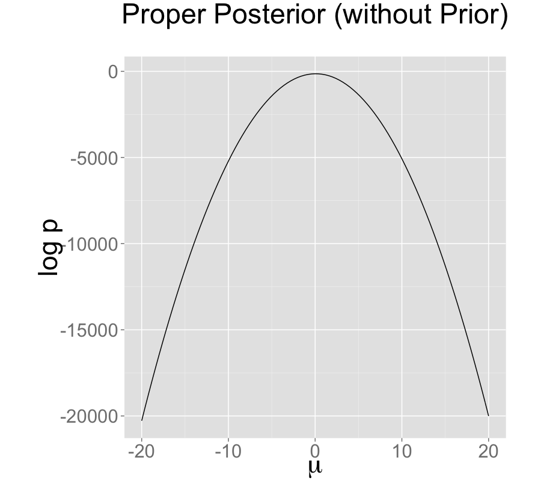

# Problematic Posteriors  {#problematic-posteriors.chapter}

Mathematically speaking, with a proper posterior, one can do Bayesian
inference and that's that. There is not even a need to require a
finite variance or even a finite mean---all that's needed is a finite
integral.  Nevertheless, modeling is a tricky business and even
experienced modelers sometimes code models that lead to improper
priors.  Furthermore, some posteriors are mathematically sound, but
ill-behaved in practice.  This chapter discusses issues in models that
create problematic posterior inferences, either in general for
Bayesian inference or in practice for Stan.


## Collinearity of Predictors in Regressions {#collinearity.section}

This section discusses problems related to the classical notion of
identifiability, which lead to ridges in the posterior density and
wreak havoc with both sampling and inference.

### Examples of Collinearity {-}

#### Redundant Intercepts {-}

The first example of collinearity is an artificial example involving
redundant intercept parameters.^[This example was raised by Richard McElreath on the Stan users group in a query about the difference in behavior between Gibbs sampling as used in BUGS and JAGS and the Hamiltonian Monte Carlo (HMC) and no-U-turn samplers (NUTS) used by Stan.]

Suppose there are observations $y_n$ for $n \in 1{:}N$,
two intercept parameters $\lambda_1$ and
$\lambda_2$, a scale parameter $\sigma > 0$, and the sampling distribution

$$
y_n \sim \mathsf{normal}(\lambda_1 + \lambda_2, \sigma).
$$

For any constant $q$, the sampling density for $y$ does not change if
we add $q$ to $\lambda_1$ and subtract it from $\lambda_2$, i.e.,

$$
p(y | \lambda_1, \lambda_2,\sigma)
=
p(y | \lambda_1 + q, \lambda_2 - q, \sigma).
$$

The consequence is that an improper uniform prior $p(\mu,\sigma)
\propto 1$ leads to an improper posterior.  This impropriety arises
because the neighborhoods around $\lambda_1 + q, \lambda_2 - q$ have
the same mass no matter what $q$ is.  Therefore, a sampler would need
to spend as much time in the neighborhood of $\lambda_1=1000000000$
and $\lambda_2=-1000000000$ as it does in the neighborhood of
$\lambda_1=0$ and $\lambda_2=0$, and so on for ever more far-ranging
values.

The marginal posterior $p(\lambda_1,\lambda_2|y)$ for this model is
thus improper.^[The marginal posterior $p(\sigma|y)$ for $\sigma$ is proper here as long as there are at least two distinct data points.]

The impropriety shows up visually as a ridge in the posterior density,
as illustrated in the left-hand plot.  The ridge for this model is
along the line where $\lambda_2 = \lambda_1 + c$ for some constant
$c$.

Contrast this model with a simple regression with a single intercept
parameter $\mu$ and sampling distribution
$$
y_n \sim \mathsf{normal}(\mu,\sigma).
$$
Even with an improper prior, the posterior is proper as long as there
are at least two data points $y_n$ with distinct values.


#### Ability and Difficulty in IRT Models {-}

Consider an item-response theory model for students $j \in 1{:}J$ with
abilities $\alpha_j$ and test items $i \in 1{:}I$ with difficulties
$\beta_i$.  The observed data are an $I \times J$ array with entries
$y_{i, j} \in \{ 0, 1 \}$ coded such that $y_{i, j} = 1$ indicates that
student $j$ answered question $i$ correctly.  The sampling
distribution for the data is

$$
y_{i, j} \sim \mathsf{Bernoulli}(\mbox{logit}^{-1}(\alpha_j - \beta_i)).
$$

For any constant $c$, the probability of $y$ is unchanged by adding a
constant $c$ to all the abilities and subtracting it from all the
difficulties, i.e.,

$$
p(y | \alpha, \beta)
=
p(y | \alpha + c, \beta - c).
$$

This leads to a multivariate version of the ridge displayed by the
regression with two intercepts discussed above.

#### General Collinear Regression Predictors {-}

The general form of the collinearity problem arises when predictors
for a regression are collinear.  For example, consider a linear
regression sampling distribution
$$
y_n \sim \mathsf{normal}(x_n \beta, \sigma)
$$
for an $N$-dimensional observation vector $y$, an $N \times K$ predictor
matrix $x$, and a $K$-dimensional coefficient vector $\beta$.

Now suppose that column $k$ of the predictor matrix is a multiple of
column $k'$, i.e., there is some constant $c$ such that $x_{n,k} = c
\, x_{n,k'}$ for all $n$.  In this case, the coefficients $\beta_k$
and $\beta_{k'}$ can covary without changing the predictions, so that
for any $d \neq 0$,

$$
p(y | \ldots, \beta_k, \ldots, \beta_{k'}, \ldots, \sigma)
=
p(y | \ldots, d  \beta_k, \ldots, \frac{d}{c} \, \beta_{k'}, \ldots,
\sigma).
$$

Even if columns of the predictor matrix are not exactly collinear as
discussed above, they cause similar problems for inference if they are
nearly collinear.


#### Multiplicative Issues with Discrimination in IRT {-}

Consider adding a discrimination parameter $\delta_i$ for each
question in an IRT model, with data sampling model
$$
y_{i, j} \sim \mathsf{Bernoulli}(\mbox{logit}^{-1}(\delta_i(\alpha_j - \beta_i))).
$$
For any constant $c \neq 0$, multiplying $\delta$ by $c$ and dividing
$\alpha$ and $\beta$ by $c$ produces the same likelihood,
$$
p(y|\delta,\alpha,\beta)
= p(y|c \delta, \, \frac{1}{c}\alpha, \, \frac{1}{c}\beta).
$$
If $c < 0$, this switches the signs of every component in $\alpha$,
$\beta$, and $\delta$ without changing the density.


#### Softmax with $K$ vs. $K-1$ Parameters {-}

In order to parameterize a $K$-simplex (i.e., a $K$-vector with
non-negative values that sum to one), only $K - 1$ parameters are
necessary because the $K$th is just one minus the sum of the first $K
- 1$ parameters, so that if $\theta$ is a $K$-simplex,

$$
\theta_K = 1 - \sum_{k=1}^{K-1} \theta_k.
$$

The softmax function maps a $K$-vector $\alpha$ of linear predictors
to a $K$-simplex $\theta = \mbox{softmax}(\alpha)$ by defining

$$
\theta_k = \frac{\exp(\alpha_k)}{\sum_{k'=1}^K \exp(\alpha_k')}.
$$

The softmax function is many-to-one, which leads to a lack of
identifiability of the unconstrained parameters $\alpha$.  In
particular, adding or subtracting a constant from each $\alpha_k$
produces the same simplex $\theta$.


### Mitigating the Invariances {-}

All of the examples discussed in the previous section allow
translation or scaling of parameters while leaving the data
probability density invariant.  These problems can be mitigated in
several ways.

#### Removing Redundant Parameters or Predictors {-}

In the case of the multiple intercepts, $\lambda_1$ and $\lambda_2$,
the simplest solution is to remove the redundant intercept, resulting
in a model with a single intercept parameter $\mu$ and sampling
distribution $y_n \sim \mathsf{normal}(\mu, \sigma)$.  The same
solution works for solving the problem with collinearity---just remove
one of the columns of the predictor matrix $x$.

#### Pinning Parameters {-}

The IRT model without a discrimination parameter can be fixed by
pinning one of its parameters to a fixed value, typically 0.  For
example, the first student ability $\alpha_1$ can be fixed to 0.  Now
all other student ability parameters can be interpreted as being
relative to student 1.  Similarly, the difficulty parameters are
interpretable relative to student 1's ability to answer them.

This solution is not sufficient to deal with the multiplicative
invariance introduced by the question discrimination parameters
$\delta_i$.  To solve this problem, one of the difficulty parameters,
say $\delta_1$, must also be constrained.  Because it's a
multiplicative and not an additive invariance, it must be constrained
to a non-zero value, with 1 being a convenient choice.  Now all of the
discrimination parameters may be interpreted relative to item 1's
discrimination.

The many-to-one nature of $\mbox{softmax}(\alpha)$ is typically
mitigated by pinning a component of $\alpha$, for instance fixing
$\alpha_K = 0$.  The resulting mapping is one-to-one from $K-1$
unconstrained parameters to a $K$-simplex.  This is roughly how
simplex-constrained parameters are defined in Stan; see the reference
manual chapter on constrained parameter transforms for a precise
definition.  The Stan code for creating a simplex from a $K-1$-vector
can be written as

```
vector softmax_id(vector alpha) {
  vector[num_elements(alpha) + 1] alphac1;
  for (k in 1:num_elements(alpha))
    alphac1[k] = alpha[k];
  alphac1[num_elements(alphac1)] = 0;
  return softmax(alphac1);
}
```


#### Adding Priors {-}

So far, the models have been discussed as if the priors on the
parameters were improper uniform priors.

A more general Bayesian solution to these invariance problems is to
impose proper priors on the parameters.  This approach can be used to
solve problems arising from either additive or multiplicative
invariance.

For example, normal priors on the multiple intercepts,
$$
\lambda_1, \lambda_2 \sim \mathsf{normal}(0,\tau),
$$
with a constant scale $\tau$, ensure that the posterior mode is
located at a point where $\lambda_1 = \lambda_2$, because this
minimizes $\log \mathsf{normal}(\lambda_1|0,\tau) + \log
\mathsf{normal}(\lambda_2|0,\tau)$.^[A Laplace prior (or an L1 regularizer for penalized maximum likelihood estimation) is not sufficient to remove this additive invariance.  It provides shrinkage, but does not in and of itself identify the parameters because adding a constant to $\lambda_1$ and subtracting it from $\lambda_2$ results in the same value for the prior density.]

The following plots show the posteriors for two intercept
parameterization without prior, two intercept parameterization with
standard normal prior, and one intercept reparameterization without
prior.  For all three cases, the posterior is plotted for 100 data
points drawn from a standard normal.

The two intercept parameterization leads to an improper prior with a ridge extending infinitely to the northwest and southeast.


Adding a standard normal prior for the intercepts results in a proper posterior.


The single intercept parameterization with no prior also has a proper posterior.



id:non-identifiable-density.figure


The addition of a prior to the two intercepts model is shown in the
second plot; the final plot shows the result of reparameterizing to a
single intercept.

An alternative strategy for identifying a $K$-simplex parameterization
$\theta = \mbox{softmax}(\alpha)$ in terms of an unconstrained
$K$-vector $\alpha$ is to place a prior on the components of $\alpha$
with a fixed location (that is, specifically avoid hierarchical priors
with varying location).  Unlike the approaching of pinning $\alpha_K =
0$, the prior-based approach models the $K$ outcomes symmetrically
rather than modeling $K-1$ outcomes relative to the $K$-th.  The
pinned parameterization, on the other hand, is usually more efficient
statistically because it does not have the extra degree of (prior
constrained) wiggle room.


#### Vague, Strongly Informative, and Weakly Informative Priors {-}

Care must be used when adding a prior to resolve invariances.  If the
prior is taken to be too broad (i.e., too vague), the resolution is in
theory only, and samplers will still struggle.

Ideally, a realistic prior will be formulated based on substantive
knowledge of the problem being modeled.  Such a prior can be chosen to
have the appropriate strength based on prior knowledge.  A strongly
informative prior makes sense if there is strong prior information.

When there is not strong prior information, a weakly informative prior
strikes the proper balance between controlling computational inference
without dominating the data in the posterior.  In most problems, the
modeler will have at least some notion of the expected scale of the
estimates and be able to choose a prior for identification purposes
that does not dominate the data, but provides sufficient computational
control on the posterior.

Priors can also be used in the same way to control the additive
invariance of the IRT model.  A typical approach is to place a strong
prior on student ability parameters $\alpha$ to control scale simply
to control the additive invariance of the basic IRT model and the
multiplicative invariance of the model extended with a item
discrimination parameters; such a prior does not add any prior
knowledge to the problem.  Then a prior on item difficulty can be
chosen that is either informative or weakly informative based on prior
knowledge of the problem.


## Label Switching in Mixture Models {#label-switching-problematic.section}

Where collinearity in regression models can lead to infinitely many
posterior maxima, swapping components in a mixture model leads to
finitely many posterior maxima.

### Mixture Models {-}

Consider a normal mixture model with two location parameters $\mu_1$
and $\mu_2$, a shared scale $\sigma > 0$, a mixture ratio $\theta \in
[0,1]$, and likelihood
$$
p(y|\theta,\mu_1,\mu_2,\sigma)
= \prod_{n=1}^N \big( \theta \, \mathsf{normal}(y_n|\mu_1,\sigma)
                       + (1 - \theta) \, \mathsf{normal}(y_n|\mu_2,\sigma) \big).
$$
The issue here is exchangeability of the mixture components, because
$$
p(\theta,\mu_1,\mu_2,\sigma|y) = p((1-\theta),\mu_2,\mu_1,\sigma|y).
$$
The problem is exacerbated as the number of mixture components $K$
grows, as in clustering models, leading to $K!$ identical posterior
maxima.

### Convergence Monitoring and Effective Sample Size {-}

The analysis of posterior convergence and effective sample size is
also difficult for mixture models.  For example, the $\hat{R}$
convergence statistic reported by Stan and the computation of
effective sample size are both compromised by label switching.  The
problem is that the posterior mean, a key ingredient in these
computations, is affected by label switching, resulting in a posterior
mean for $\mu_1$ that is equal to that of $\mu_2$, and a posterior
mean for $\theta$ that is always 1/2, no matter what the data are.

### Some Inferences are Invariant {-}

In some sense, the index (or label) of a mixture component is
irrelevant.  Posterior predictive inferences can still be carried out
without identifying mixture components.  For example, the log
probability of a new observation does not depend on the identities of
the mixture components.  The only sound Bayesian inferences in such
models are those that are invariant to label switching.  Posterior
means for the parameters are meaningless because they are not
invariant to label switching; for example, the posterior mean for
$\theta$ in the two component mixture model will always be 1/2.

### Highly Multimodal Posteriors {-}

Theoretically, this should not present a problem for inference because
all of the integrals involved in posterior predictive inference will
be well behaved. The problem in practice is computation.

Being able to carry out such invariant inferences in practice is an
altogether different matter.  It is almost always intractable to find
even a single posterior mode, much less balance the exploration of the
neighborhoods of multiple local maxima according to the probability
masses. In Gibbs sampling, it is unlikely for $\mu_1$
to move to a new mode when sampled conditioned on the current values
of $\mu_2$ and $\theta$. For HMC and NUTS, the problem is that the
sampler gets stuck in one of the two "bowls" around the modes and
cannot gather enough energy from random momentum assignment to move
from one mode to another.

Even with a proper posterior, all known sampling and inference
techniques are notoriously ineffective when the number of modes grows
super-exponentially as it does for mixture models with increasing
numbers of components.

### Hacks as Fixes {-}

Several hacks (i.e., "tricks") have been suggested and employed to
deal with the problems posed by label switching in practice.

#### Parameter Ordering Constraints {-}

One common strategy is to impose a constraint on the parameters that
identifies the components.  For instance, we might consider
constraining $\mu_1 < \mu_2$ in the two-component normal mixture model
discussed above.  A problem that can arise from such an approach is
when there is substantial probability mass for the opposite ordering
$\mu_1 > \mu_2$.  In these cases, the posteriors are affected by
the constraint and true posterior uncertainty in $\mu_1$ and $\mu_2$
is not captured by the model with the constraint.  In addition,
standard approaches to posterior inference for event probabilities is
compromised.  For instance, attempting to use $M$ posterior samples to
estimate $\mbox{Pr}[\mu_1 > \mu_2]$, will fail, because the estimator
$$
\mbox{Pr}[\mu_1 > \mu_2]
\approx
\sum_{m=1}^M \mbox{I}(\mu_1^{(m)} > \mu_2^{(m)})
$$
will result in an estimate of 0 because the posterior respects the
constraint in the model.

#### Initialization around a Single Mode {-}

Another common approach is to run a single chain or to initialize the
parameters near realistic values.^[Tempering methods may be viewed as automated ways to carry
  out such a search for modes, though most MCMC tempering methods
  continue to search for modes on an ongoing basis; see
  [@SwendsenWang:1986; @Neal:1996b].]

This can work better than the hard constraint approach if reasonable
initial values can be found and the labels do not switch within a
Markov chain.  The result is that all chains are glued to a
neighborhood of a particular mode in the posterior.

## Component Collapsing in Mixture Models

It is possible for two mixture components in a mixture model to
collapse to the same values during sampling or optimization.  For
example, a mixture of $K$ normals might devolve to have $\mu_i =
\mu_j$ and $\sigma_i = \sigma_j$ for $i \neq j$.

This will typically happen early in sampling due to initialization in
MCMC or optimization or arise from random movement during MCMC.  Once
the parameters match for a given draw $(m)$, it can become hard to
escape because there can be a trough of low-density mass between the
current parameter values and the ones without collapsed components.

It may help to use a smaller step size during warmup, a stronger prior
on each mixture component's membership responsibility.  A more extreme
measure is to include additional mixture components to deal with the
possibility that some of them may collapse.

In general, it is  difficult to recover exactly the right $K$
mixture components in a mixture model as $K$ increases beyond one
(yes, even a two-component mixture can have this problem).


## Posteriors with Unbounded Densities

In some cases, the posterior density grows without bounds as
parameters approach certain poles or boundaries.  In such, there
are no posterior modes and numerical stability issues can arise as
sampled parameters approach constraint boundaries.

### Mixture Models with Varying Scales {-}

One such example is a binary mixture model with scales varying by
component, $\sigma_1$ and $\sigma_2$ for locations $\mu_1$ and
$\mu_2$. In this situation, the density grows without bound as
$\sigma_1 \rightarrow 0$ and $\mu_1 \rightarrow y_n$ for some $n$;
that is, one of the mixture components concentrates all of its mass
around a single data item $y_n$.

### Beta-Binomial Models with Skewed Data and Weak Priors {-}

Another example of unbounded densities arises with a posterior such as
$\mathsf{Beta}(\phi|0.5,0.5)$, which can arise if seemingly weak beta
priors are used for groups that have no data. This density is
unbounded as $\phi \rightarrow 0$ and $\phi \rightarrow 1$. Similarly,
a Bernoulli likelihood model coupled with a "weak" beta prior, leads
to a posterior

$$
\begin{array}{rcl}
p(\phi|y)
& \propto & \textstyle
\mathsf{Beta}(\phi|0.5,0.5) * \prod_{n=1}^N \mathsf{Bernoulli}(y_n|\phi)
\\[4pt]
& = &\textstyle
\mathsf{Beta}(\phi \, | \, 0.5 + \sum_{n=1}^N y_n, \ \ 0.5 + N - \sum_{n=1}^N y_n).
\end{array}
$$

If $N = 9$ and each $y_n = 1$, the posterior is
$\mathsf{Beta}(\phi|9.5,0,5)$.  This posterior is unbounded as $\phi
\rightarrow 1$.  Nevertheless, the posterior is proper, and although
there is no posterior mode, the posterior mean is well-defined with a
value of exactly 0.95.

#### Constrained vs.\ Unconstrained Scales {-}

Stan does not sample directly on the constrained $(0,1)$ space for
this problem, so it doesn't directly deal with unconstrained density
values.  Rather, the probability values $\phi$ are logit-transformed
to $(-\infty,\infty)$.  The boundaries at 0 and 1 are pushed out to
$-\infty$ and $\infty$ respectively.  The Jacobian adjustment that
Stan automatically applies ensures the unconstrained density is
proper.  The adjustment for the particular case of $(0,1)$ is $\log
\mbox{logit}^{-1}(\phi) + \log \mbox{logit}(1 - \phi)$.

There are two problems that still arise, though.  The first is that if
the posterior mass for $\phi$ is near one of the boundaries, the
logit-transformed parameter will have to sweep out  long paths and
thus can dominate the U-turn condition imposed by the no-U-turn
sampler (NUTS).  The second issue is that the inverse transform from
the unconstrained space to the constrained space can underflow to 0 or
overflow to 1, even when the unconstrained parameter is not infinite.
Similar problems arise for the expectation terms in logistic
regression, which is why the logit-scale parameterizations of the
Bernoulli and binomial distributions are more stable.


## Posteriors with Unbounded Parameters

In some cases, the posterior density will not grow without bound, but
parameters will grow without bound with gradually increasing density
values.  Like the models discussed in the previous section that have
densities that grow without bound, such models also have no posterior
modes.


### Separability in Logistic Regression {-}

Consider a logistic regression model with $N$ observed outcomes $y_n
\in \{ 0, 1 \}$, an $N \times K$ matrix $x$ of predictors, a
$K$-dimensional coefficient vector $\beta$, and sampling distribution
$$
y_n \sim \mathsf{Bernoulli}(\mbox{logit}^{-1}(x_n \beta)).
$$
Now suppose that column $k$ of the predictor matrix is such that
$x_{n,k} > 0$ if and only if $y_n = 1$, a condition known as
``separability."  In this case, predictive accuracy on the observed data
continue to improve as $\beta_k \rightarrow \infty$, because for cases
with $y_n = 1$, $x_n \beta \rightarrow \infty$ and hence
$\mbox{logit}^{-1}(x_n \beta) \rightarrow 1$.

With separability, there is no maximum to the likelihood and hence no
maximum likelihood estimate.  From the Bayesian perspective, the
posterior is improper and therefore the marginal posterior mean for
$\beta_k$ is also not defined.  The usual solution to this problem in
Bayesian models is to include a proper prior for $\beta$, which
ensures a proper posterior.


## Uniform Posteriors

Suppose your model includes a parameter $\psi$ that is defined on
$[0,1]$ and is given a flat prior $\mathsf{Uniform}(\psi|0,1)$. Now if
the data don't tell us anything about $\psi$, the posterior is also
$\mathsf{Uniform}(\psi|0,1)$.

Although there is no maximum likelihood estimate for $\psi$, the
posterior is uniform over a closed interval and hence proper.  In the
case of a uniform posterior on $[0,1]$, the posterior mean for $\psi$
is well-defined with value $1/2$.  Although there is no posterior
mode, posterior predictive inference may nevertheless do the right
thing by simply integrating (i.e., averaging) over the predictions for
$\psi$ at all points in $[0,1]$.


## Sampling Difficulties with Problematic Priors

With an improper posterior, it is theoretically impossible to properly
explore the posterior. However, Gibbs sampling as performed by BUGS
and JAGS, although still unable to properly sample from such an
improper posterior, behaves differently in practice than the
Hamiltonian Monte Carlo sampling performed by Stan when faced with an
example such as the two intercept model discussed in
the [collinearity section](#collinearity.section) and illustrated in
the non-identifiable density plot.

### Gibbs Sampling {-}

Gibbs sampling, as performed by BUGS and JAGS, may appear to be
efficient and well behaved for this unidentified model, but as
discussed in the previous subsection, will not actually explore the
posterior properly.

Consider what happens with initial values $\lambda_1^{(0)}, \lambda_2^{(0)}$.
Gibbs sampling proceeds in iteration $m$ by drawing

$$
\begin{array}{rcl}
\lambda_1^{(m)}
& \sim & p(\lambda_1 \, | \, \lambda_2^{(m-1)}, \, \sigma^{(m-1)}, \, y)
\\[6pt]
\lambda_2^{(m)}
& \sim & p(\lambda_2 \, | \, \lambda_1^{(m)}, \, \sigma^{(m-1)}, \, y)
\\[6pt]
\sigma^{(m)}
& \sim & p(\sigma \, | \, \lambda_1^{(m)}, \, \lambda_2^{(m)}, \, y).
\end{array}
$$

Now consider the draw for $\lambda_1$ (the draw for $\lambda_2$ is
symmetric), which is conjugate in this model and thus can be done 
efficiently.  In this model, the range from which the next $\lambda_1$
can be drawn is highly constrained by the current values of
$\lambda_2$ and $\sigma$.  Gibbs will run  quickly and provide
seemingly reasonable inferences for $\lambda_1 + \lambda_2$.  But it
will not explore the full range of the posterior; it will merely take
a slow random walk from the initial values.  This random walk behavior
is typical of Gibbs sampling when posteriors are highly correlated and
the primary reason to prefer Hamiltonian Monte Carlo to Gibbs sampling
for models with parameters correlated in the posterior.

### Hamiltonian Monte Carlo Sampling {-}

Hamiltonian Monte Carlo (HMC), as performed by Stan, is much more
efficient at exploring posteriors in models where parameters are
correlated in the posterior.  In this particular example, the
Hamiltonian dynamics (i.e., the motion of a fictitious particle given
random momentum in the field defined by the negative log posterior) is
going to run up and down along the valley defined by the potential
energy (ridges in log posteriors correspond to valleys in potential
energy).  In practice, even with a random momentum for $\lambda_1$ and
$\lambda_2$, the gradient of the log posterior is going to adjust for
the correlation and the simulation will run $\lambda_1$ and
$\lambda_2$ in opposite directions along the valley corresponding to
the ridge in the posterior log density.


### No-U-Turn Sampling {-}

Stan's default no-U-turn sampler (NUTS), is even more efficient at
exploring the posterior; see
@Hoffman-Gelman:2011 and @Hoffman-Gelman:2014.  NUTS simulates the
motion of the fictitious particle representing the parameter values
until it makes a U-turn, it will be defeated in most cases, as it will
just move down the potential energy valley indefinitely without making
a U-turn. What happens in practice is that the maximum number of
leapfrog steps in the simulation will be hit in many of the
iterations, causing a  large number of log probability and
gradient evaluations (1000 if the max tree depth is set to 10, as in
the default). Thus sampling will appear to be  slow.  This is
indicative of an improper posterior, not a bug in the NUTS algorithm
or its implementation.  It is simply not possible to sample from an
improper posterior!  Thus the behavior of HMC in general and NUTS
in particular should be reassuring in that it will clearly fail in
cases of improper posteriors, resulting in a clean diagnostic of
sweeping out  large paths in the posterior.

Here are results of Stan runs with default parameters fit to
  $N=100$ data points generated from $y_n \sim \mathsf{normal}(0,1)$:

*Two Scale Parameters, Improper Prior*

```
Inference for Stan model: improper_stan
Warmup took (2.7, 2.6, 2.9, 2.9) seconds, 11 seconds total
Sampling took (3.4, 3.7, 3.6, 3.4) seconds, 14 seconds total

                  Mean     MCSE   StdDev        5%       95%  N_Eff  N_Eff/s  R_hat
lp__          -5.3e+01  7.0e-02  8.5e-01  -5.5e+01  -5.3e+01    150       11    1.0
n_leapfrog__   1.4e+03  1.7e+01  9.2e+02   3.0e+00   2.0e+03   2987      212    1.0
lambda1        1.3e+03  1.9e+03  2.7e+03  -2.3e+03   6.0e+03    2.1     0.15    5.2
lambda2       -1.3e+03  1.9e+03  2.7e+03  -6.0e+03   2.3e+03    2.1     0.15    5.2
sigma          1.0e+00  8.5e-03  6.2e-02   9.5e-01   1.2e+00     54      3.9    1.1
mu             1.6e-01  1.9e-03  1.0e-01  -8.3e-03   3.3e-01   2966      211    1.0
```

*Two Scale Parameters, Weak Prior*

```
Warmup took (0.40, 0.44, 0.40, 0.36) seconds, 1.6 seconds total
Sampling took (0.47, 0.40, 0.47, 0.39) seconds, 1.7 seconds total

                 Mean     MCSE   StdDev        5%    95%  N_Eff  N_Eff/s  R_hat
lp__              -54  4.9e-02  1.3e+00  -5.7e+01    -53    728      421    1.0
n_leapfrog__      157  2.8e+00  1.5e+02   3.0e+00    511   3085     1784    1.0
lambda1          0.31  2.8e-01  7.1e+00  -1.2e+01     12    638      369    1.0
lambda2         -0.14  2.8e-01  7.1e+00  -1.2e+01     12    638      369    1.0
sigma             1.0  2.6e-03  8.0e-02   9.2e-01    1.2    939      543    1.0
mu               0.16  1.8e-03  1.0e-01  -8.1e-03   0.33   3289     1902    1.0
```

*One Scale Parameter, Improper Prior*

```
Warmup took (0.011, 0.012, 0.011, 0.011) seconds, 0.044 seconds total
Sampling took (0.017, 0.020, 0.020, 0.019) seconds, 0.077 seconds total

                Mean     MCSE  StdDev        5%   50%   95%  N_Eff  N_Eff/s  R_hat
lp__             -54  2.5e-02    0.91  -5.5e+01   -53   -53   1318    17198    1.0
n_leapfrog__     3.2  2.7e-01     1.7   1.0e+00   3.0   7.0     39      507    1.0
mu              0.17  2.1e-03    0.10  -3.8e-03  0.17  0.33   2408    31417    1.0
sigma            1.0  1.6e-03   0.071   9.3e-01   1.0   1.2   2094    27321    1.0
```


  On the top is the non-identified model with improper uniform priors
  and likelihood $y_n \sim \mathsf{normal}(\lambda_1 + \lambda_2,
  \sigma)$.

  In the middle is the same likelihood as the middle plus priors
  $\lambda_k \sim \mathsf{normal}(0,10)$.

  On the bottom is an identified model with an improper prior, with
  likelihood  $y_n \sim \mathsf{normal}(\mu,\sigma)$.  All models
  estimate $\mu$ at roughly 0.16 with low Monte Carlo standard
  error, but a high posterior standard deviation of 0.1;  the true
  value $\mu=0$ is within the 90% posterior intervals in all three models.

id:non-identified-stan-fits.figure


### Examples: Fits in Stan {-}

To illustrate the issues with sampling from non-identified and only
weakly identified models, we fit three models with increasing degrees
of identification of their parameters.  The posteriors for these
models is illustrated in the non-identifiable density plot.  The
first model is the unidentified model with two location parameters and
no priors discussed in the [collinearity section](#collinearity.section).

```
data {
  int N;
  real y[N];
}
parameters {
  real lambda1;
  real lambda2;
  real<lower=0> sigma;
}
transformed parameters {
  real mu;
  mu = lambda1 + lambda2;
}
model {
  y ~ normal(mu, sigma);
}
```

The second adds priors to the model block for `lambda1` and
`lambda2` to the previous model.

```
  lambda1 ~ normal(0, 10);
  lambda2 ~ normal(0, 10);
```

The third involves a single location parameter, but no priors.

```
data {
  int N;
  real y[N];
}
parameters {
  real mu;
  real<lower=0> sigma;
}
model {
  y ~ normal(mu, sigma);
}
```

All three of the example models were fit in Stan 2.1.0 with default
parameters (1000 warmup iterations, 1000 sampling iterations, NUTS
sampler with max tree depth of 10). The results are shown in the
non-identified fits figure. The key statistics from these outputs are
the following.


* As indicated by `R_hat` column, all parameters have
  converged other than $\lambda_1$ and $\lambda_2$ in the
  non-identified model.

* The average number of leapfrog steps is roughly 3 in
  the identified model, 150 in the model identified by a weak prior, and
  1400 in the non-identified model.

* The number of effective samples per
  second for $\mu$ is roughly 31,000 in the identified model, 1900 in the model
  identified with weakly informative priors, and 200 in the
  non-identified model; the results are similar for $\sigma$.

* In the non-identified model, the 95% interval for $\lambda_1$ is
  (-2300,6000), whereas it is only (-12,12) in the model identified with
  weakly informative priors.

*  In all three models, the simulated value of $\mu=0$ and $\sigma=1$
  are well within the posterior 90% intervals.

The first two points, lack of convergence and hitting the maximum
number of leapfrog steps (equivalently maximum tree depth) are
indicative of improper posteriors.  Thus rather than covering up the
problem with poor sampling as may be done with Gibbs samplers,
Hamiltonian Monte Carlo tries to explore the posterior and its failure
is a clear indication that something is amiss in the model.
