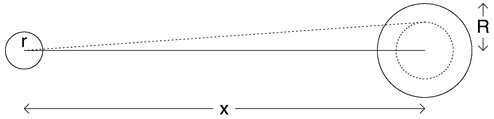

# Simple Examples

## What is in this chapter?

We introduce Bayesian data analysis and Stan through a set of examples
that are small but have aspects of real problems.  Here are the
examples we use in this chapter:

* Golf putting.  A simple nonlinear regression model demonstrating the
  flexibility of Stan to fit arbitrarily specified models, and
  demonstrating the advantages of thoughtful modeling applied to real
  data.

* Movie ratings.  A fake-data example of an item-response problem.  We
  build up the model in different ways and demonstrate how to use
  fake-data simulation.

* World Cup.  A simple item-response model fit to real data with an
  external predictor, thus two data sources to be combined.  One
  feature of this example is that the first model we fit had a bug
  which took us some work to find out.

* Sex ratio.  A Bayesian analysis of a notorious example from the
  biology literature in which headlines were obtained from what was
  essentially pure noise.  This is a good example of the importance of
  prior information when data are weak, and because the problem is so
  simple, with only one parameter of interest, we can show graphically
  how the posterior distribution is a compromise between the prior
  distribution and the likelihood.

* Time series competition.  A simple example in which we push through
  all the steps from data processing, through Bayesian modeling and
  inference, to decision analysis.  This example also demonstrates how
  to fit a mixture model in Stan.

* Declining exponential.  A nonlinear model that comes up in many
  science and engineering applications, also illsutrating the use of
  bounds in parameter estimation.

* Sum of declining exponentials.  An important class of nonlinear
  models that can be surprisingly difficult to estimate from data.
  This example illustrates how Stan can fail, and also the way in
  which default prior information can add stability to an otherwise
  intractable problem.

We perform all these computations in R and Stan---processing data in
R, fitting models in Stan, and using R for postprocessing of
inferences and graphics---but we suppress the R code, as our focus is
on the Stan programming.  You can go to the raw knitr document (the
.Rmd file) in order to see the R code and reproduce all these
analyses.

## Golf putting

The following graph shows data on the proportion of successful golf
putts as a function of distance from the hole.  Unsurprisingly, the
probability of making the shot declines as a function of distance:

```{r}
golf <- read.table("data/golf.txt", header=TRUE, skip=2)
x <- golf$x
y <- golf$y
n <- golf$n
J <- length(y)
r <- (1.68/2)/12
R <- (4.25/2)/12
se <- sqrt((y/n)*(1-y/n)/n)
par(mar=c(3,3,2,1), mgp=c(1.7,.5,0), tck=-.02)
plot(x, y/n, xlim=c(0, 1.1*max(x)), ylim=c(0, 1.02),
     xaxs="i", yaxs="i", pch=20, bty="l",
     xlab="Distance from hole (feet)",
     ylab="Probability of success", main="Data on putts in pro golf")
segments(x, y/n + se, x, y/n-se, lwd=.5)
text(x + .4, y/n + se + .02, paste(y, "/", n,sep=""), cex=.6, col="gray40")
```

The error bars associated with each point $j$ in the above graph are
simple binomial standard deviations,
$\sqrt{\hat{p}_j(1-\hat{p}_j)/n_j}$, where $\hat{p_j}=y_j/n_j$ is the
success rate for putts taken at distance $x_j$.

### Logistic regression {-}

Can we model the probability of success in golf putting as a function
of distance from the hole?  Given usual statistical practice, the
natural starting point would be logistic regression:

$$
y_j\sim\mbox{binomial}(n_j, \mbox{logit}^{-1}(a + bx_j)),
\mbox{ for } j=1,\dots, J.
$$

In Stan, this is:

```{r}
print_file("stan/golf_logistic.stan")
```

Here is the result of fitting this model to the data:

```{r, results=FALSE}
golf_data <- list(x=x, y=y, n=n, J=J)
fit_logistic <- stan("stan/golf_logistic.stan", data=golf_data)
```
```{r}
print(fit_logistic)
```

Stan has computed the posterior means $\pm$ standard deviations of $a$
and $b$ to be $2.23\pm 0.06$ and $-0.26\pm 0.01$, respectively. The
Monte Carlo standard error of the mean of each of these parameters is
0 (to two decimal places), indicating that the simulations have run
long enough to estimate the posterior means precisely.  The posterior
quantiles give a sense of the uncertainty in the parameters, with 50%
posterior intervals of $[2.19,2.27]$ and $[-0.26,-0.25]$ for $a$ and
$b$, respectively.  Finally, the values of $\widehat{R}$ near 1 tell
us that the simulations from Stan's four simulated chains have mixed
well.

The following graph shows the fit plotted along with the data:

```{r}
sims_logistic <- as.matrix(fit_logistic)
a_hat <- median(sims_logistic[,"a"])
b_hat <- median(sims_logistic[,"b"])
n_sims <- nrow(sims_logistic)
par(mar=c(3,3,2,1), mgp=c(1.7,.5,0), tck=-.02)
plot(x, y/n, xlim=c(0, 1.1*max(x)), ylim=c(0, 1.02),
     xaxs="i", yaxs="i", pch=20, bty="l",
     xlab="Distance from hole (feet)",
     ylab="Probability of success", main="Fitted logistic regression")
segments(x, y/n + se, x, y/n-se, lwd=.5)
for (i in sample(n_sims, 20))
  curve(invlogit(sims_logistic[i,"a"] + sims_logistic[i,"b"]*x),
        from=0, to=1.1*max(x), lwd=0.5, add=TRUE)
curve(invlogit(a_hat + b_hat*x), from=0, to=1.1*max(x), add=TRUE)
text(10.6, .57, paste("Logistic regression,\n    a = ",
                      fround(a_hat, 2), ", b = ", fround(b_hat, 2), sep=""))
```

The thick line shows the fit corresponding to the posterior median
estimates of the parameters $a$ and $b$; the light lines show 20 draws
from the posterior distribution.

### Modeling from first principles {-}

As an alternative to logistic regression, we shall build a model from
first principles and fit it to the data.  The graph below shows a
simplified sketch of a golf shot.  The dotted line represents the
angle within which the ball of radius $r$ must be hit so that it falls
within the hole of radius $R$.  This threshold angle is
$\sin^{-1}((R-r)/x)$.



The next step is to model human error.  We assume that the golfer is
attempting to hit the ball completely straight but that many small
factors interfere with this goal, so that the actual angle follows a
normal distribution centered at 0 with some standard deviation
$\sigma$.

The probability the ball goes in the hole is then the probability that
the angle is less than the threshold; that is,
$2\Phi(\sin^{-1}((R-r)/x)) - 1$, where $\Phi$ is the cumulative normal
distribution function.

Our model then has two parts:
$$y_j \sim \mbox{binomial}(n_j, p_j)$$
$$p_j = 2\Phi(\sin^{-1}((R-r)/x)) - 1 , \mbox{ for } j=1,\dots, J.$$

Here is the model in Stan:

```{r}
print_file("stan/golf1.stan")
```

The data $J,n,x,y$ have already been set up; we just need to define
$r$ and $R$ (the golf ball and hole have diameters 1.68 and 4.25
inches, respectively), and run the Stan model:

```{r, results=FALSE}
r <- (1.68/2)/12
R <- (4.25/2)/12
fit_trig <- stan("stan/golf1.stan", data=golf_data)
```

Here is the result:

```{r}
print(fit_trig)
```

The model has a single parameter, $\sigma$.  From the output, we find
that Stan has computed the posterior mean of $\sigma$ to be 0.0267
(multiplying this by $180/\pi$, this comes to 1.5 degrees).  The Monte
Carlo standard error of the mean is 0 (to four decimal places),
indicating that the simulations have run long enough to estimate the
posterior mean precisely.  The posterior standard deviation is
calculated at 0.0004 (that is, 0.02 degrees), indicating that $\sigma$
itself has been estimated with high precision, which makes sense given
the large number of data points and the simplicity of the model.  The
precise posterior distribution of $\sigma$ can also be seen from the
narrow range of the posterior quantiles.  Finally, $\widehat{R}$ is
near 1, telling us that the simulations from Stan's four simulated
chains have mixed well.

We next plot the data and the fitted model (here using the posterior
median of $\sigma$ but in this case the uncertainty is so narrow that
any reasonable posterior summary would give essentially the same
result), along with the logistic regression fitted earlier:

```{r}
sims_trig <- as.matrix(fit_trig)
sigma_hat <- median(sims_trig[,"sigma"])
par(mar=c(3,3,2,1), mgp=c(1.7,.5,0), tck=-.02)
plot(x, y/n, xlim=c(0, 1.1*max(x)), ylim=c(0, 1.02),
     xaxs="i", yaxs="i", pch=20, bty="l",
     xlab="Distance from hole (feet)",
     ylab="Probability of success",
     main="Two models fit to the golf putting data")
segments(x, y/n + se, x, y/n-se, lwd=.5)
curve(invlogit(a_hat + b_hat*x), from=0, to=1.1*max(x), add=TRUE)
x_grid <- seq(R-r, 1.1*max(x), .01)
p_grid <- 2*pnorm(asin((R-r)/x_grid) / sigma_hat) - 1
lines(c(0, R-r, x_grid), c(1, 1, p_grid))
text(10.3, .58, "Logistic regression")
text(18.5, .24, "Geometry-based model")
```

The custom nonlinear model fits the data much better.  This is not to
say that the model is perfect---any experience of golf will reveal
that the angle is not the only factor determining whether the ball
goes in the hole---but it seems like a useful start, and it is good to
know that we can fit nonlinear models by just coding them up in Stan.

## Movie ratings

Consider the following scenario.  You are considering which of two
movies to go see.  Both have average online ratings of 4 out of 5
stars, but one is based on 2 ratings and the other is based on 100.
Which movie should you go see?

We will set this up as a statistics problem, making the assumption
that you would prefer to see the movie that is most preferred, on
average, by others.  That is, we can imagine every movie having a
"true popularity" which would be the average rating, if everyone in
the population were to see this movie and rate it on a 0--5 scale. We
are thus implicitly assuming that these two movies are aimed at the
same target audience, which includes you.

We further assume that each of these movies has been rated by a random
sample of people from this general audience: thus, we can consider the
observed average rating of 4.0 in each case to be an estimate of the
true popularity of each movie.  At the end of this example, we will
discuss how to relax these assumptions.

At first you might think that since both movies have average ratings
of 4.0, it's a tossup which one to see.

But the estimate based on 2 ratings should be much less accurate than
the estimate based on 100 ratings. If you really want to see a 4-star
movie, the one with 100 ratings should be a safer bet.

We'll now make this point using Bayesian inference, going through the
following steps:

- Constructing data fitting the above story and fitting a Bayesian
  model to get inferences about the true popularity of the two movies.

- Embedding this all in a larger problem with many movies being rated.

- Setting up a model in which different people rate different movies,
  with systematic differences between who rates which movies.

- Espanding the model to allow for the possibility that more people
  see, and rate, movies that are more popular.

For each step, we set up a model, simulate fake data from that model,
and check that we can recover the underlying parameters to some level
of accuracy.

### Model for 2 movies {-}

Define $\theta_j, j=1,2$ to be the true popularities of the two
movies, with any randomly selected rating for movie $j$ being drawn
from a normal distribution with mean $\theta_j$ and standard deviation
$\sigma$.

For simplicity, we're pretending radings are continuous unbounded
numbers (rather than integers from 0 through 5) and that the
distributions of ratings for the teo movies differ only in their mean,
not their variance.  We're not allowing, for example, a polarizing
movie that you either love or hate.  The ratings distribution for any
movie is assumed to be bell-shaped.  Again, we can later go back and
expand our models to allow other possibilities.

In our initial example, we have 102 ratings: 2 for one movie and 100
for the other.  We label the individual ratings as
$y_i,i=1,\dots,N=102$ and index the movies being rated as $j[i]$,
where $j[1]=j[2]=1$ and $j[3]=j[4]=\dots=j[102]=2$.  We can then write
our model as, $$y_i \sim \mbox{normal}(\theta_{j[i]}, \sigma),
i=1,\dots,N.$$ In statistics notation such as used in _Bayesian Data
Analysis_, the normal distribution is written in terms of mean and
variance, or squared standard deviation: $y \sim
\mbox{normal}(\mu,\sigma^2)$.  But in this book we will follow Stan
notation and write $y \sim \mbox{normal}(\mu,\sigma)$.

To perform Bayesian inference we also need a prior distribution on all
the parameters, which in this case are $\theta_1$, $\theta_2$, and
$\sigma$.

First, the parameters have some mathematical constraints.  The
available ratings are 0 through 5, so each $\theta$ must fall in that
range as well, and $\sigma$ cannot be more than 2.5, and that is the
maximum standard deviation among all distributions defined in the
range $[0,5]$ (with that maximum attained with the distribution with
all its mass at the extremes, with half the responses at 0 and half at
5).

Beyond this, we will assume that movies typically get ratings of
around three stars.  We'll give normal prior distributions with mean 3
and standard deviation 1 to each of the parameters $\theta_1$ and
$\theta_2$, which represent the underlying or population-average
ratings of the two movies.

Here is the resulting Stan model:

```{r}
print_file("stan/ratings_1.stan")
```

Near the bottom of the above program, the lines blocked off with a
slash and star are comments, indicating how the vectorization in the
Stan language allows us to assign an entire set of probability
distributions at once.

We next construct data for our two movies.  For movie 1, we suppose
the two ratings are 3 and 5, which give the posited average rating of
4.  For movie 2, we suppose the ratings are 10 2's, 20 3's, 30 4's,
and 40 5's, which again average to 4.  This set of hypothetical
ratings does _not_ follow the assumed normal distribution, but that's
fine; we can still fit the model.

```{r, results=FALSE}
y_1 <- c(3, 5)
y_2 <- rep(c(2,3,4,5), c(10,20,30,40))
y <- c(y_1, y_2)
N <- length(y)
movie <- rep(c(1,2), c(length(y_1), length(y_2)))
movie_data <- list(y=y, N=N, movie=movie)
fit_1 <- stan("stan/ratings_1.stan", data=movie_data)
```

Here is the result:

```{r}
print(fit_1)
```

The estimated population average popularity is 3.6 for the first movie
and 4.0 for the second.  We hae more information on the second movie,
so we can more precisely estimate it as truly meriting 4 stars in the
public assessment: the 50% posterior interval for $\theta_2$ is $[3.9,
4.1]$.  In contrast, we have a lot more uncertainty about $\theta_1$,
which according to our model has a 50% probability of being in the
range $[3.2, 4.0]$ but could be as low as 2.5 or as high as 4.7.

So, which movie to see?  It depends on your goals.  Movie 2 is a safer
bet, with a higher estimated quality.  But Movie 1 has a small chance
of being outstanding, along with a moderate chance of being mediocre.
You can see Movie 1 if you want to roll the dice.

### Estending the model to J movies {-}

It is easy to expand the Stan program to allow an arbitrary number of movies:

```{r}
print_file("stan/ratings_2.stan")
```

As usual, to really understand this model, it helps to be able to
simulate fake data.  Let's set $J=40$ movies and let the number of
times each movie is rated be a random number, uniformly distributed
between 0 and 100.  We start by drawing parameters $\theta_j$ from a
normal distribution with mean 3 and standard deviation 0.5 (so that
the movies' true popularities are mostly between 2 and 4 on that 0--5
scale), and then sample continuous individual ratings $z_i$ for each
movie $j[i]$ from a normal distribution with mean $\theta_{j[i]}$ and
standard deviation 2: $$ \theta_j \sim \mbox{normal}(3.0, 0.5), \mbox{
for } j=1,\dots,J \\ z_i \sim \mbox{normal}(\theta_{j[i]}, 2.0),
\mbox{ for } i=1,\dots,n.  $$ To keep things simple, we will ignore
the fact that the ratings are constrained to be between 0 and 5;
instead, we will simulate continuous ratings on an unbounded scale.
It is not difficult in Stan to model ordered discrete responses; see
Chapter **.  Here, though, we will ignore that feature of the data.

We simulate the fake data in R and then fit the new model in Stan.

```{r, results=FALSE}
J <- 40

# Assign each movie a random number of ratings between 0 and 100
N_ratings <- sample(0:100, J, replace=TRUE)
N <- sum(N_ratings)

# Create a vector indexing which movie corresponds to each rating
movie <- rep(1:J, N_ratings)
theta <- rnorm(J, 3.0, 0.5)
y <- rnorm(N, theta[movie], 2.0)
movie_data <- list(y=y, N=N, J=J, movie=movie)
fit_2 <- stan("stan/ratings_2.stan", data=movie_data)
```

Here is the result:

```{r}
print(fit_2)
```

We can check the fit by plotting the posterior inferences against the true parameter values:

```{r}
theta_post <- extract(fit_2)$theta
quants <- c(0.025, 0.25, 0.5, 0.75, 0.975)
theta_post_quants <-
  array(NA, c(J,length(quants)), dimnames=list(NULL, quants))
for (j in 1:J) {
  theta_post_quants[j,] <- quantile(theta_post[,j], quants)
}
par(mar=c(3,3,2,1), mgp=c(1.7,.5,0), tck=-.02)
par(pty="s")
rng <- range(theta_post_quants, theta)
plot(rng, rng, xlab = "Posterior median, 50%, and 95% interval",
     ylab = "True parameter value", bty = "l", type = "n")
abline(0, 1, col = "gray")
points(theta_post_quants[ , "0.5"], theta, pch=20)
for (j in 1:J) {
  lines(c(theta_post_quants[j, "0.25"], theta_post_quants[j, "0.75"]),
        rep(theta[j], 2), lwd = 2)
  lines(c(theta_post_quants[j, "0.025"], theta_post_quants[j, "0.975"]),
        rep(theta[j], 2), lwd = 0.5)
}
mtext("Comparing parameters theta_j to their posterior inferences", side=3)
```

Roughly half the 50% intervals and 95% of the 95% intervals contain
the true parameter value, which is about what we would expect to see,
given that we have simulated data from the model we are fitting.

The intervals in the above graph vary in width.  The more data we have
for any given movie, the more precise is our estimate of its
underlying popularity.  Here is a graph showing the width of the 50%
interval as a function of sample size:

```{r}
interval_width <- theta_post_quants[,"0.75"] - theta_post_quants[,"0.25"]
par(mar=c(3,3,2,1), mgp=c(1.7,.5,0), tck=-.02)
plot(c(0, 1.02*max(N_ratings)), c(0, 1.02*max(interval_width)),
     xlab="Number of ratings", ylab="Width of 50% posterior interval",
     yaxs="i", yaxs="i", bty="l", type="n")
points(N_ratings, interval_width, pch=20)
mtext("Where you have more data, you have less uncertainty", side=3)
```

The only reason the points do not completely fall along a smooth curve
here is that the intervals are computed using simulation.  Here we
have 4000 simulation draws.  If we were to run Stan longer and obtain
more iterations, then the resulting intervals would be more stable,
and the above graph would look smoother.  For all practical purposes,
though, we have enough simulations and enough iterations.  For
example, if $\theta_1$ has a posterior 50% interval of $[3.1, 3.5]$,
there is no real reason to get a huge number of simulations and to
find out that the precise interval is $[3.13, 3.48]$, as this makes no
real difference in our understanding of $\theta_3$, nor should it
seriously affect any decision we might want to make using these data.

### Item-response model with parameters for raters and for movies {-}

There are many ways to extend the above model.  To start with, we can
recognize that different people rate different movies, and each rater
uses his or own scale.  Suppose, for example, that some people tend to
give high ratings and others tend to give low ratings, and the sorts
of people who give high ratings are more likely to watch romantic
comedies, while the tougher judges more frequently watch crime movies.
Then a simple comparison of average ratings will be unfair to the
crime movies, as this does not take into account systematic
differences between raters.

We can model rater effects using what is called an _item-response
model_, the simplest form of which looks like this, for a numerical
rating $y_i$ of movie $j[i]$ by rater $k[i]$,

$$
y_i \sim \mbox{normal}(a_{j[i]} - b_{k[i]}, \sigma_y),
$$
Here, $a_j$ is a parameter that could be said to represent movie
"quality," corresponding to the average rating that movie $j$ would
receive, if it were reviewed by average raters.  The parameter $b_k$
represents the "difficulty" of rater $k$: higher values of $b_k$
correspond to raters who give tougher judgments of equivalent movies.

The previous model is equivalent to this new model with all the
$b_k$'s fixed at zero.  When fitting the new model, we constrain the
$b_k$'s to come from a distribution whose average is zero.  Some such
constraint is necessary because otherwise the model would not be
_identified_: for example, you could add 100 to each of the $a_j$'s
and $-100$ to each of the $b_k$'s and not change any of the predictors
at all.

Our full model looks like this:

$$
y_i \sim \mbox{normal}(a_{j[i]} - b_{k[i]}, \sigma_y),
  \mbox{ for } i=1,\dots, N
\\
a_j \sim \mbox{normal}(\mu_a, \sigma_a), \mbox{ for } j=1,\dots, J
\\
b_k \sim \mbox{normal}(0, \sigma_b), \mbox{ for } k=1,\dots, K.
$$

We also need prior distributions for the as-yet-unmodeled parameters
$\mu_a, \sigma_a, \sigma_b, \sigma_y$.

But before setting that up, we re-express the model in a way that will
be generally useful:

$$
y_i
  \sim \mbox{normal}(\mu + \sigma_a*\alpha_{j[i]} - \sigma_b*\beta_{k[i]},
                     \sigma_y),
  \mbox{ for } i=1,\dots, N
\\
\alpha_j \sim \mbox{normal}(0, 1),
  \mbox{ for } j=1,\dots, J
\\
\beta_k \sim \mbox{normal}(0, 1),
  \mbox{ for } k=1,\dots, K.
$$
This new version, sometimes called the _non-centered
parameterization_, is convenient because it separates the scaled and
unscaled parameters; also it can have certain computational
advantages, as discussed here: [point to Mike Betancourt's case
study?].  The new models are equivalent, with the movle quality
parameters being expressed as, $a_j = \mu + \sigma_{\alpha}*\alpha_j$.

And now we can add prior distributions.  We will start with uniform
priors (subject to the constraint that $\sigma_a$, $\sigma_b$, and
$\sigma_y$ must all be positive), adding in prior information later if
the data are weak enough that this seems necessary.

Here is the Stan program:
```{r}
print_file("stan/ratings_3.stan")
```
As usual, we'll check it by simulating fake data, then fitting the
model in Stan and checking that the parameters are recovered.

We'll start by simulating data from $J=40$ movkes and $K=100$ raters,
with each person rating each movie, and with parameters $\mu=3$ (thus,
an average rating of 3 for all movies and all raters), $\sigma_a=0.5$,
$\sigma_b=0.5$ (thus, the same amount of variation in raters'
difficulties than in the quality of movies) and $\sigma_y=2$, as
before.

```{r, results=FALSE}
J <- 40
K <- 100
N <- J*K
movie <- rep(1:J, rep(K, J))
rater <- rep(1:K, J)
mu <- 3
sigma_a <- 0.5
sigma_b <- 0.5
sigma_y <- 2
alpha <- rnorm(J, 0, 1)
beta <- rnorm(K, 0, 1)
y <- rnorm(N, mu + sigma_a*alpha[movie] + sigma_b*beta[rater], sigma_y)
data_3 <- list(N=N, J=J, K=K, movie=movie, rater=rater, y=y)
fit_3 <- stan("stan/ratings_3.stan", data=data_3)
```

Here is part of the Stan fit.  We just display the hyperparameters, to
save space omitting the parameter vectors $\alpha$ and $\beta$ and the
transformed parameter vector $a$.

```{r}
print(fit_3, pars=c("mu", "sigma_a", "sigma_b", "sigma_y"))
```

Stan did fine recovering the variance parameters.  The mean level
$\mu$ is more difficult to nail down, but the true value of 3.0 is
within the range of posterior uncertainty.

Let's check the coverage for the $\alpha$'s and $\beta$'s:

```{r}
par(mfrow=c(1,2))
alpha_post <- extract(fit_3)$alpha
beta_post <- extract(fit_3)$beta
quants <- c(0.025, 0.25, 0.5, 0.75, 0.975)
alpha_post_quants <-
  array(NA, c(J, length(quants)), dimnames=list(NULL, quants))
beta_post_quants <-
  array(NA, c(K, length(quants)), dimnames=list(NULL, quants))
for (j in 1:J) {
  alpha_post_quants[j,] <- quantile(alpha_post[,j], quants)
}
for (k in 1:K) {
  beta_post_quants[k,] <- quantile(beta_post[,k], quants)
}
par(mar=c(3,3,2,1), mgp=c(1.7,.5,0), tck=-.02)
par(pty="s")

rng <- range(alpha_post_quants, alpha)
plot(rng, rng, xlab="Posterior median, 50%, and 95% interval",
     ylab="True parameter value", bty="l", type="n")
abline(0, 1, col="gray")
points(alpha_post_quants[,"0.5"], alpha, pch=20)
for (j in 1:J){
  lines(c(alpha_post_quants[j,"0.25"], alpha_post_quants[j,"0.75"]),
        rep(alpha[j], 2), lwd=2)
  lines(c(alpha_post_quants[j,"0.025"], alpha_post_quants[j,"0.975"]),
        rep(alpha[j], 2), lwd=0.5)
}
mtext("Checking the alpha_j's", side=3)
rng <- range(beta_post_quants, beta)
plot(rng, rng, xlab="Posterior median, 50%, and 95% interval",
     ylab="True parameter value", bty="l", type="n")
abline(0, 1, col="gray")
points(beta_post_quants[,"0.5"], beta, pch=20)
for (k in 1:K){
  lines(c(beta_post_quants[k,"0.25"], beta_post_quants[k,"0.75"]),
        rep(beta[k], 2), lwd=2)
  lines(c(beta_post_quants[k,"0.025"], beta_post_quants[k,"0.975"]),
        rep(beta[k], 2), lwd=0.5)
}
mtext("Checking the beta_k's", side=3)
```

Now let's put our model to more of a challenge by giving it unbalanced
data.  Let's divide the movies into two groups: romantic comedies
(movies $j=1,\dots,20$) and crime stories (movies $j=21,\dots,40$),
and set things up so that the more difficult reviewers (those with
positive values of $\alpha_k$) are more likely to review crime
stories.

We'll set up the simulation as follows.  Each of the $K$ people might
rate each of the $J$ movies. If $\beta_k>0$, then person $k$ will have
a 30% chance of rating each romantic comedy and a 60% chance of rating
each crime movie.  If $\beta_k<0$, then the probabilities are
reversed, and person $k$ has a 30% chance of rating each romantic
comedy and a 60% chance of rating each crime movie.  So, in the data,
we'll expect to see tougher reviews on the crime stories.

We simulate this model, using the same ratings as before but just
selecting a subset according to the above-defined probabilities.

```{r, results=FALSE}
genre <- rep(c("romantic","crime"), c(round(J/2), J - round(J/2)))
prob_of_rated <- ifelse(beta[rater] > 0,
                        ifelse(genre[movie] == "romantic", 0.6, 0.3),
                        ifelse(genre[movie] == "romantic", 0.3, 0.6))
# Returns TRUE if movie was rated, FALSE if not
rated <- rbinom(N, 1, prob_of_rated)
data_3a <-
  list(N=sum(rated), J=J, K=K, movie=movie[rated],
       rater=rater[rated], y=y[rated])
fit_3a <- stan("stan/ratings_3.stan", data=data_3)
```

We then fit the model in Stan.

```{r}
print(fit_3a, pars=c("mu", "sigma_a", "sigma_b", "sigma_y"))
```

And display as before.  In the left graph we use open circles for the
romantic comedies (those with $j=1,\dots,10$) and solid circles for
the crime movies ($j=11,\dots,20$). In the right graph we use open
circles for the nice reviewers (those with $\beta_k<0$) and solid
circles for the difficult reviewers ($\beta_k<0$).  Coverage still
seems fine, which it should be---again, we ran our simulations under
the model that we later fit---but it is still gratifying to see, as a
confirmation that we are not making any obvious mistakes.

```{r}
add_legend <- function(text, pch, range) {
  legend(0.6*min(range)+0.4*max(range),
         min(range)+0.12*(max(range)-min(range)),
	 text[1], pch=pch[1], cex=0.8, bty="n")
  legend(0.6*min(range)+0.4*max(range),
         min(range)+0.06*(max(range)-min(range)),
	 text[2], pch=pch[2], cex=0.8, bty="n")
}
par(mfrow=c(1,2), oma=c(0,0,1,0))
alpha_post <- extract(fit_3a)$alpha
beta_post <- extract(fit_3a)$beta
quants <- c(0.025, 0.25, 0.5, 0.75, 0.975)
alpha_post_quants <-
  array(NA, c(J,length(quants)), dimnames=list(NULL, quants))
beta_post_quants <-
  array(NA, c(K,length(quants)), dimnames=list(NULL, quants))
for (j in 1:J){
  alpha_post_quants[j,] <- quantile(alpha_post[,j], quants)
}
for (k in 1:K) {
  beta_post_quants[k,] <- quantile(beta_post[,k], quants)
}
par(mar=c(3,3,2,1), mgp=c(1.7,.5,0), tck=-.02)
par(pty="s")
rng <- range(alpha_post_quants, alpha)
plot(rng, rng, xlab="Posterior median, 50%, and 95% interval",
     ylab="True parameter value", bty="l", type="n")
abline(0, 1, col="gray")
points(alpha_post_quants[genre=="romantic", "0.5"], alpha[genre=="romantic"],
       pch=1, cex=0.9)
points(alpha_post_quants[genre=="crime", "0.5"], alpha[genre=="crime"], pch=20)
for (j in 1:J){
  lines(c(alpha_post_quants[j,"0.25"], alpha_post_quants[j,"0.75"]),
        rep(alpha[j], 2), lwd=2)
  lines(c(alpha_post_quants[j,"0.025"], alpha_post_quants[j,"0.975"]),
        rep(alpha[j], 2), lwd=0.5)
}
add_legend(c("Romantic comedies", "Crime movies"), pch=c(1, 20), range=rng)
mtext("Checking the alpha_j's", side=3)
rng <- range(beta_post_quants, beta)
plot(rng, rng, xlab="Posterior median, 50%, and 95% interval",
     ylab="True parameter value", bty="l", type="n")
abline(0, 1, col="gray")
points(beta_post_quants[beta<0, "0.5"], beta[beta<0], pch=1, cex=0.9)
points(beta_post_quants[beta>0, "0.5"], beta[beta>0], pch=20)
for (k in 1:K){
  lines(c(beta_post_quants[k,"0.25"], beta_post_quants[k,"0.75"]),
        rep(beta[k], 2), lwd=2)
  lines(c(beta_post_quants[k,"0.025"], beta_post_quants[k,"0.975"]),
        rep(beta[k], 2), lwd=0.5)
}
add_legend(c("Nice raters", "Difficult raters"), pch=c(1, 20), range=rng)
mtext("Checking the beta_k's", side=3)
mtext("Checking fits for model when difficult reviewers were more likely to rate certain genres",
      side=3, outer=TRUE)
```

We next do some analysis to show how naive averaging of ratings will
give misleading estimates of movie quality, and the model-based
estimates correct for this bias.  We first compute the average
observed rating, $\bar{y}_j$ for each movie $j$.

```{r}
ybar<- rep(NA, J)
for (j in 1:J){
  # Assign an average rating of 3 to any movie that has zero ratings
  if (sum(movie == j & rated) == 0) {
    ybar[j] <- 3
  }
  else {
    ybar[j] <- mean(y[movie == j & rated])
  }
}
```

Recall that in our model this maps to the transformed parameter
$a_j=\mu + \sigma_a*\alpha_j$, the expected average rating that we
would see if everyone in the population rated every movie.  We compute
the posterior median of $a_j$ and also recall its true value from the
process used to simulate the data.

```{r}
a <- mu + sigma_a * alpha
a_post <- extract(fit_3a)$a
a_post_median <- apply(a_post, 2, median)
```

We then plot true movie quality (the parameter , first versus raw
average rating, then versus the model-based estimate:

```{r}
par(mfrow=c(1,2))
par(mar=c(3,3,2,1), mgp=c(1.7,.5,0), tck=-.02)
par(pty="s")

rng <- range(a_post_median, ybar, a)
plot(rng, rng, xlab="Raw average rating for movie j",
     ylab="True a_j", bty="l", type="n")
abline(0, 1, col="gray")
points(ybar[genre=="romantic"], a[genre=="romantic"], pch=1, cex=0.9)
points(ybar[genre=="crime"], a[genre=="crime"], pch=20)
mtext("Problems with raw averaging", side=3)
add_legend(c("Romantic comedies", "Crime movies"), pch=c(1, 20), range=rng)
plot(rng, rng, xlab="Posterior median estimate for movie j",
     ylab="True a_j", bty="l", type="n")
abline(0, 1, col="gray")
points(a_post_median[genre=="romantic"], a[genre=="romantic"], pch=1, cex=0.9)
points(a_post_median[genre=="crime"], a[genre=="crime"], pch=20)
mtext("Model-based estimates do better", side=3)
add_legend(c("Romantic comedies", "Crime movies"), pch=c(1, 20), range=rng)
mtext("Problems with raw averages when difficult reviewers were more likely to rate certain genres",
      side=3, outer=TRUE)
```

The raw averages for the romantic comedies are mostly too high: The
open circles on the first plot are mostly to the right of the diagonal
line, implying that those averages $\bar{y}_j$ are higher than the
true values of the movie quality parameters $a_j$.  Meanwhile the raw
averages for the crime movies are mostly too low, with the solid dots
on the first plot mostly to the left of the diagonal line.  This all
makes sense, as we have constructed our simulation so that the
romantic comedies are more likely to be rated by nicer reviewers, and
the crime movies are more likely to rated by tougher reviewers.

The model adjusts for these biases, though, and so the model-based
estimates, shown in the second plot above, do not have these
systematic problems.

### Other potential extentions to the model {-}

Here are some of the many ways in which the model could be generalized
in order to make it more realistic:

* More popular movies should get more ratings.  So we might want to
  extend the model to allow the probability of a person rating a movie
  to depend on the movie's popularity, which here is coded by the
  parameter $\alpha_j$.

* Different people have different preferences for different genres.
  The model could capture this by allowing each person to have a
  vector of difficulty parameters, one for each genre.

* Movie ratings are discrete; we could replace the normal distribution
  for $y_i$ by an ordered logistic model which would give
  probabilities of each of the discrete responses from 0 through 5.

## World Cup

We fit a model to estimate the abilities of the teams in the 2014
soccer World Cup.  We fit a simple linear item response model, using
the score differentials as data (ignoring the shoot-outs). We also
have a feeling that when the game is not close the extra goals don't
provide as much information so we'll fit the model on the square-root
scale.

The model is as follows: if game $i$ has teams $j_1$ and team $j_2$
playing, and they score $z_1$ and $z_2$ goals, respectively, then the
data point for this game is $y_i =
\mbox{sign}(z_1-z_2)*\sqrt{|z_1-z_2|}$, and the data model is: $y_i
\sim \mbox{normal}(a_{j_1[i]}-a_{j_2[i]}, \sigma_y)$, where $a_{j_1}$
and $a_{j_2}$ are the ability parameters (to use psychometrics jargon)
for the two teams and $\sigma_y$ is a scale parameter estimated from
the data. But then before fitting the model we was thinking of
occasional outliers such as that Germany-Brazil match so we decided
that a $t$ model could make more sense:
$$
y_i \sim \mbox{t}(\nu, a_{j_1[i]}-a_{j_2[i]}, \sigma_y),
$$
setting the degrees of freedom to $\nu=7$ which has been occasionally
recommended as a robust alternative to the normal.

It turned out, when the model was all fit and we started tinkering
with it, that neither the square root transformation nor the
long-tailed $t$ distribution were really necessary to model the soccer
scores; a simple normal model would have been fine.  But we'll work
with this particular model because that was how we first thought of
setting it up.

There weren't so many World Cup games (only 64 games in total for 32
teams) so we augmented the dataset by partially pooling the ability
parameters toward an external data source, something called the Soccer
Power Index that was available on the internet a month before the
tournament.  We took the rankings, with Brazil at the top (getting a
score of 32) and Australia at the bottom (with a score of 1), and then
for simplicity in interpretation of the parameters we rescaled these
to have mean 0 and standard deviation 1/2, to get "prior scores" that
ranged from $-0.83$ to + $0.83$.

Our model for the team abilities was then simply, $a_j \sim
\mbox{normal}(\mu + b*\mbox{prior\_score}_j, \sigma_a)$, which we
write as $a_j=\mu+b*\mbox{prior\_score}_j+\sigma_a*\alpha_j$, with
$\alpha_j\sim\mbox{normal}(0,1) \mbox{ for } j=1,\dots,J=32$.
Actually, though, all we care about are the relative, not the
absolute, team abilities, so we can just set $\mu=0$, so that the
model is, $$a_j = b*\mbox{prior\_score}_j+\sigma_a*\alpha_j, \mbox{
with } \alpha_j \sim \mbox{normal}(0, 1), \mbox{ for }
j=1,\dots,J=32.$$ At this point we should probably add weakly
informative priors for $b$, $\sigma_a$, and $\sigma_y$, but we didn't
bother. We can always go back and add these to stabilize the
inferences, but 32 teams should be enough to estimate these parameters
so we don't think it will be necessary in this case.

We now set up the model in Stan:
```{r}
print_file("stan/worldcup_first_try.stan")
```

The stuff in the transformed data block is to transform the raw data
into signed square root differentials.  (The function "fabs" is short
for "floating point absolute value.")  It turns out this code has a
mistake in it, which we will get to in a bit.

```{r, results=FALSE}
teams <- as.vector(unlist(read.table("data/soccerpowerindex.txt",
                                     header=FALSE)))
N_teams <- length(teams)
prior_score <- rev(1:N_teams)
prior_score <- (prior_score - mean(prior_score)) / (2 * sd(prior_score))
data2014 <- read.table ("data/worldcup2014.txt", header=FALSE)
N_games <- nrow(data2014)
team_1 <- match(as.vector(data2014[[1]]), teams)
score_1 <- as.vector(data2014[[2]])
team_2 <- match(as.vector(data2014[[3]]), teams)
score_2 <- as.vector(data2014[[4]])
df <- 7
data_worldcup <- c("N_teams", "N_games", "team_1", "score_1",
                   "team_2", "score_2", "prior_score", "df")
fit_1 <- stan("stan/worldcup_first_try.stan", data=data_worldcup)
```

The simulations converge, and the estimates seem reasonable.

```{r}
print(fit_1, c("a", "b", "sigma_a", "sigma_y", "lp__"))
```

The simulations converge, and we can look at the parameter estimates:

* Recall that the 32 teams are listed in order of their prior ranking,
   with Brazil and Argentina at the top and Australia at the bottom,
   so the posterior mean estimates for the team abilities $a$ seem
   reasonable.  The posterior intervals for the different teams
   overlap a lot, which makes sense given that most of teams only play
   3 or 4 games in the tournament.

* The estimated coefficient $b$ is positive, indicating that teams
  with higher prior rankings did better in the tournament, which makes
  sense; the estimate of 0.46 implies that a good team is about half a
  goal (on the square-root scale) better than a poor team.  We can
  give this latter interpretation because we have already put the
  prior score predictor on a standardized scale.

* The group-level error standard deviation $\sigma_a$ is estimated at
  0.13 which is a small value, which indicates that, unsurprisingly,
  our final estimates of team abilities are not far from the initial
  ranking. (If $\sigma_a$ were exactly zero, then the team abilities
  would be a perfect linear function of those prior rankings.  We can
  attribute this good fit to a combination of two factors: first, the
  initial ranking is pretty accurate; second, there aren't a lot of
  data points here so not much information that would pull the teams
  away from this assumed linear model.

* The data-level error $\sigma_y$ is estimated at 0.42, implying that
  the uncertainty in any game is about half a goal on the square-root
  scale, about as much as the variation between good and bad teams.
  On any given day, any team could beat any other team.

Now it's time to make some graphs. First a simple list of estimates
and standard errors of team abilities. We'll order the teams based on
prior ranking, which makes sense for two reasons. First, this ordering
is informative: there's a general trend from good to bad so it should
be easy to understand the results. Second, the prior ranking is what
we were using to pull toward in the multilevel model, so this graph is
equivalent to a plot of estimate vs.\ group-level predictor, which is
the sort of graph we like to make to understand what a multilevel
model is doing.

```{r}
a_post <- extract(fit_1)$a
a_hat <- apply(a_post, 2, median)
a_se <- apply(a_post, 2, sd)
coefplot (rev(a_hat), rev(a_se), CI=1, varnames=rev(teams),
          main="Team quality (estimate +/- 1 s.e.)\n",
	  cex.var=.9, mar=c(0,4,5.1,2), xlim=c(-.5,.5))
```

At this point we could compute lots of fun things such as the
probability that Argentina would beat Germany if the final were played
again, but it's clear enough from this picture that the estimate will
be close to 50% so really the model isn't giving us much for that one
game.

One thing we should try to understand, though, is how much of these
estimates are coming from the prior ranking? So we very slightly alter
the model, changing two lines by moving $b$ from the parameters to the
data block in the Stan program.  Then we call the model with $b$ set
to 0.

```{r, results=FALSE}
b <- 0
fit_1_noprior <- stan("stan/worldcup_first_try_noprior.stan",
                      data=c(data_worldcup, "b"))
```
```{r}
a_post <- extract(fit_1_noprior)$a
a_hat <- apply(a_post, 2, median)
a_se <- apply(a_post, 2, sd)
coefplot(rev(a_hat), rev(a_se), CI=1, varnames=rev(teams),
         main="Team quality (estimate +/- 1 s.e.)\n",
	 cex.var=.9, mar=c(0, 4, 5.1, 2), xlim=c(-0.5, 0.5))
```

This is roughly similar to before but a lot noisier.

Now let's check model fit. For this we'll go back to the model that
includes the prior ranking as a linear predictor, predicting
replications of the games using a generated quantities block:

```
generated quantities {
  vector[N_games] y_rep
    = student_t_rng(df, a[team_1] - a[team_2], sigma_y);
  vector[N_games] y_rep_original_scale
    = y_rep * abs(y_rep);
}
```

We re-fit the model and produce the replications.  The result is a
matrix of simulations, y_rep_original_scale, representing the
posterior distribution of the outcomes of the 64 games, if the
tournament were to be repeated.  For each game we can then collect a
95% predictive interval, and we plot these along with the actual game
outcomes:

```{r, results=FALSE}
fit_1_rep <- stan("stan/worldcup_with_replication.stan", data=data_worldcup)
```
```{r}
sims <- extract(fit_1_rep)$y_rep_original_scale
q25 <- apply(sims, 2, quantile, 0.025)
q75 <- apply(sims, 2, quantile, 0.975)
coefplot (rev(score_1 - score_2), sds=rep(0, N_games),
          lower.conf.bounds=rev(q25), upper.conf.bounds=rev(q75),
          varnames=rev(paste(teams[team_1], "vs.", teams[team_2])),
          main="Game score differentials\ncompared to 95% predictive interval from model\n",
          mar=c(0,7,6,2))
```

Something went wrong.  Far more than 5% of the data points are outside
the 95% intervals.

The next step is to figure out what happened.  Our first thought was
that there was some problem with the $t$ distribution---but replacing
it by a normal, or keeping the $t$ but estimating the dsgrees of
freedom parameter, did not change anything noticeably.  Our next idea
was that the discretness of the data could be causing the problem.
But, no, that wasn't it either: the poor coverage of these intervals
goes well beyond rounding error.

What about the square-root transformation?  Could that be the problem?
Let's re-fit the model on the original scale:

```{r}
print_file("stan/worldcup_no_sqrt.stan")
```

And then again we fit the model and produce the graph of inferences:
```{r, results=FALSE}
fit_2 <- stan("stan/worldcup_no_sqrt.stan", data=data_worldcup)
```
```{r}
a_post <- extract(fit_2)$a
a_hat <- apply(a_post, 2, median)
a_se <- apply(a_post, 2, sd)
coefplot(rev(a_hat), rev(a_se), CI=1, varnames=rev(teams),
         main="Team quality (estimate +/- 1 s.e.)\n(model with no square root)\n",
	 cex.var=.9, mar=c(0, 4, 5.1, 2), xlim=c(-1.2, 1.2))
```

The parameter estimates are similar to before, but on a different
scale, which makes sense given that we're no longer working on the
square root scale.

Next we make the graph comparing game outcomes to 95% posterior
predictive intervals:

```{r}
sims <- extract(fit_2)$y_rep
q25 <- apply(sims, 2, quantile, 0.025)
q75 <- apply(sims, 2, quantile, 0.975)
coefplot (rev(score_1 - score_2), sds=rep(0, N_games),
          lower.conf.bounds=rev(q25), upper.conf.bounds=rev(q75),
          varnames=rev(paste(teams[team_1], "vs.", teams[team_2])),
          main="Game score differentials\ncompared to 95% predictive interval from model\n(model with no square root)\n",
          mar=c(0,7,6,2))
```

This looks fine: approximately 95% of the game outcomes fall within
the 95% predictive intervals.

At this point we could declare stop and declare victory, but first we
would like to figure out what went wrong with that square root model.
We look again at the code and find the error, which is inside the
transformed data block of our original Stan program:

```
sqrt_dif[i] = (step(dif[i]) - 0.5)*sqrt(fabs(dif[i]));
```

That last line is wrong---it's missing a factor of 2.  Stan doesn't
have a sign() function so I hacked something together using
"step(dif[i]) - 0.5". But this difference takes on the value $+0.5$ if
dif is positive or $-0.5$ if dif is negative.  Here is the correct
code:

```
sqrt_dif[i] = 2*(step(dif[i]) - 0.5)*sqrt(fabs(dif[i]));
```

We now put fix the Stan program, re-fit the model, and display the
parameter estimates and the two graphs as before:
```{r, results=FALSE}
fit_3 <- stan("stan/worldcup_no_sqrt.stan", data=data_worldcup)
```
```{r}
print(fit_3, pars=c("b", "sigma_a", "sigma_y", "lp__"))
a_post <- extract(fit_3)$a
a_hat <- apply(a_post, 2, median)
a_se <- apply(a_post, 2, sd)
coefplot(rev(a_hat), rev(a_se), CI=1, varnames=rev(teams),
         main="Team quality (estimate +/- 1 s.e.)\n(corrected model)\n",
	 cex.var=.9, mar=c(0, 4, 5.1, 2), xlim=c(-1.2, 1.2))
```

```{r}
sims <- extract(fit_3)$y_rep
q25 <- apply(sims, 2, quantile, 0.025)
q75 <- apply(sims, 2, quantile, 0.975)
coefplot (rev(score_1 - score_2), sds=rep(0, N_games),
          lower.conf.bounds=rev(q25), upper.conf.bounds=rev(q75),
          varnames=rev(paste(teams[team_1], "vs.", teams[team_2])),
          main="Game score differentials\ncompared to 95% predictive interval from model\n(corrected model)\n",
          mar=c(0, 7, 6, 2))
```

All is fine now.  In retrospect we never needed that square root in
the first place, but it's good to have figured out our error, in case
we need to fit such a model in the future.  It was also instructive
how we found that mistake through a routine plot comparing data to the
posterior predictive distribution.

The final 95% predictive intervals are very wide, indicating that with
the information used in this model, we can't say much about any
individual game.  That's fine; it is what it is.

## Sex ratio

We can use prior information to refine estimates from noisy studies.
For example, several years ago a researcher analyzed data from a
survey of 3000 Americans and observed a correlation between
attractiveness of parents and the sex of their children.  In
particular, the survey coded adults into five attractiveness
categories, and it turned out that 56% of the children of parents in
the highest attractiveness category were girls, compared to 48% of the
children of parents in the other categories.  The difference of 8% had
a standard error (based on the usual formula for the difference in
proportions) of 3%.

The observed difference is more than 2 standard errors from zero,
meeting the usual standard of statistical significance, and indeed the
claim that beautiful parents have more daughters was published in a
scientific journal and received wide publicity.

This is, however, not the end of the story.  It is well known that the
variation in the human sex ratio occurs in a very narrow range. For
example a recent count in the United States reported 48.7% girls among
whites and 49.2% among blacks.  Similar differences of half of a
percentage point or less have been found when comparing based on
factors such as birth order, maternal age, or season of birth.  Thus
we would find it hard to believe that any difference between more and
less attractive parents could be as large as 0.5%.

We now perform Bayesian inference using the template above.  The
parameter of interest here, $\theta$, is the probability of girl
births among beautiful parents, minus the probability among other
parents, all in the general population of Americans.  As is often the
case, we are interested in the comparison of $\theta$ to zero: Is
there strong evidence that $\theta>0$, which would imply that more
attractive parents are more likely to have girls?

We can express our scientific knowledge as a prior distribution on
$\theta$ with mean 0% and standard deviation 0.25%.  The prior mean of
zero says that, in advance of seeing the data we would have no reason
to expect beautiful parents to have an elevated or depressed rate of
girl births.  The prior standard deviation of 0.25% says that we find
it highly implausible that the true value of $\theta$ is higher than
0.5% or lower than -0.5%.

For convenience we are expressing our estimates and uncertainties on a
percentage scale, to avoid the awkwardness of working with expressions
such as 0.0025 and possibly dropping a zero somewhere.

In this case, we could perform Bayesian inference analytically: with
normally distributed data $y$ with standard error $\sigma_y$ and a
normal$(\mu_0,\sigma_0)$ prior distribution, $\theta$ is normally
distributed in its posterior distribution, with
$$\mbox{posterior mean: } \
\frac{\frac{1}{\sigma_0^2} \, \mu_0 + \frac{1}{\sigma_y^2}y}
     {\frac{1}{\sigma_0^2} + \frac{1}{\sigma_y^2}}
$$
and
$$\mbox{posterior sd: } \
\sqrt{\frac{1}{\frac{1}{\sigma_0^2} + \frac{1}{\sigma_y^2}}}
$$

But we are teaching Stan here, so we shall demonstrate the fit in
Stan.  Here is the Stan code:
```{r}
print_file("stan/normal_normal.stan")
```
One advantage of using Stan here, rather than the formula, is that
with Stan it is easy to alter the model, for example changing the
prior distribution from normal to $t$, or adding additional data in
some way or another.

But for now we shall stick with the above normal model, feeding in the
data $y = 8, \sigma_y = 3, \mu_0 = 0, \sigma_0 = 0.25$, to obtain the following
result:

```{r, results=FALSE}
sex_data <- list(y=8, sigma_y=3, mu_0=0, sigma_0=0.25)
fit1 <- stan("stan/normal_normal.stan", data=sex_data)
```
```{r}
print(fit1)
```

## Time series competition

A few years ago someone sent me an email about a "Global Climate
Challenge" that he had seen online, and which was introduced as
follows:

> It has often been claimed that alarm about global warming is
  supported by observational evidence. I have argued that there is no
  observational evidence for global-warming alarm: rather, all claims
  of such evidence rely on invalid statistical analyses.

> Some people, though, have asserted that the statistical analyses are
  valid. Those people assert, in particular, that they can determine,
  via statistical analysis, whether global temperatures have been
  increasing more than would be reasonably expected by random natural
  variation. Those people do not present any counter to my argument,
  but they make their assertions anyway.

> In response to that, I am sponsoring a contest: the prize is
  $100,000. In essence, the prize will be awarded to anyone who can
  demonstrate, via statistical analysis, that the increase in global
  temperatures is probably not due to random natural variation.

How to win the money?

> The file `data/Series1000.txt` contains 1000 time series. Each
  series has length 135: the same as that of the most commonly studied
  series of global temperatures (which span 1880–2014). The 1000
  series were generated as follows. First, 1000 random series were
  obtained (via a trendless statistical model fit for global
  temperatures). Then, some randomly-selected series had a trend added
  to them. Some trends were positive; the others were negative. Each
  individual trend was 1°C/century (in magnitude)—which is greater
  than the trend claimed for global temperatures.

> A prize of $100,000 (one hundred thousand U.S. dollars) will be
  awarded to the first person who submits an entry that correctly
  identifies at least 900 series: which series were generated by a
  trendless process and which were generated by a trending process.

But also this:

> Each entry must be accompanied by a payment of $10.

OK, now it's time to get to work.  We start by downloading and
graphing the data.
```{r}
series <- matrix(scan("data/Series1000.txt"), nrow=1000, ncol=135, byrow=TRUE)
T <- 135
N <- 1000
par(mar=c(3,3,2,0), tck=-.01, mgp=c(1.5,.5,0))
plot(c(1,T), range(series), bty="l", type="n", xlab="Time", ylab="series")
for (n in 1:N) {
  lines(1:T, series[n,], lwd=.5)
}
```

Aha! The lines are fanning out from a common starting point. We'll fit
a regression to each line and then summarize each line by its average
slope.

```{r}
slope <- rep(NA, N)
se <- rep(NA, N)
for (n in 1:N){
  data <- series[n,]
  time <- 1:T
  fit <- lm(data ~ time)
  slope[n] <- 100*coef(fit)[2]
  se[n] <- 100*se.coef(fit)[2]
}
```

We multiplied the slopes (and standard errors) by 100 to put them on a
per-century scale to match the above instructions.

Next we plot the estimated slopes and their standard errors:

```{r}
plot(slope, se, bty="l", xlab="Slope", ylab="SE", pch=20)
```

OK, not much information in the se's. How about a histogram of the
estimated slopes?

```{r}
hist(slope, xlab="Slope", breaks=seq(floor(10*min(slope)), ceiling(10*max(slope)))/10)
```

Based on the problem description, I'd expect to see distributions
centered at 0, -1, and 1. It looks like this might be the case.

So let's fit a mixture model. That's easy.  Here's the Stan program:

```{r}
print_file("stan/mixture.stan")
```

We now run the program and display the results:

```{r}
y <- slope
K <- 3
mu <- c(0,-1,1)
data <- list(y=y, K=K, mu=mu)
mix <- stan("stan/mixture.stan", data=data)
print(mix)
```

Convergence is fine: $\widehat{R}$ is close to 1 for everything.  The
estimated weights of the three mixture components are approximately
0.5, 0.25, 0.25. Given that the problem was made up, I'm guessing the
weights of the underlying data-generation process are exactly 1/2,
1/4, and 1/4. The standard deviation of the slopes within each
component is 0.4, or close to it. We could also try fitting a model
where the standard deviations of the three components differ, but we
won't, partly because the description given with the simulated data
described the change as adding a trend, and partly because the above
histogram doesn't seem to show any varying of the widths of the
mixture components.

OK, now we're getting somewhere. To make predictions, we need to know,
for each series, the probability of it being in each of the three
components. We'll compute these probabilities by adding a generated
quantities block to the Stan program:

```
generated quantities {
  matrix[N,K] p;
  for (n in 1:N){
    vector[K] p_raw;
    for (k in 1:K){
      p_raw[k] <- theta[k]*exp(normal_log(y[n], mu[k], sigma));
    }
    for (k in 1:K){
      p[n,k] <- p_raw[k]/sum(p_raw);
    }
  }
}
```

We then re-fit the model, extract the $p$'s, and average them over the
posterior simulations.

```{r, results=FALSE}
mix <- stan("stan/mixture_2.stan", data=data)
prob_sims <- extract(mix)$p
prob <- array(NA, c(N,K))
for (n in 1:N){
  for (k in 1:K){
    prob[n,k] <- mean(prob_sims[,n,k])
  }
}
```

We now have a $1000\times 3$ matrix of probabilities. Let's take a
look at the first ten rows

```{r}
pfround(prob[1:10,], 2)
```

So, the first series is probably drawn from the sloping-upward model;
the second might be from the null model or it might be from the
sloping-downward model; the third, fourth, fifth, sixth, seventh, and
eighth are probably from the null model; the ninth is probably from
the sloping-upward model; and so forth.

We'll now program this: for each of the 1000 series in the dataset,
we'll pick which of the three mixture components has the highest
probability. We'll save the probability and also which component is
being picked.

```{r}
max_prob <- apply(prob, 1, max)
choice <- apply(prob, 1, which.max)
```

And now we can sum this over the 1000 series. We'll compute the number
of series assigned to each of the three choices:

```{r}
print(table(choice))
```

The guesses are not quite in proportion 500, 250, 250. There seem to
be too many guesses of zero slope and not enough of positive and
negative slopes. But that makes sense given the decision problem: we
want to maximize the number of correct guesses so we end up
disproportionately guessing the most common category. That's fine;
it's how it will be.

And we can compute the expected number of correct guesses (based on
the posterior distribution we have here), and the standard deviation
of the number of correct guesses (based on the reasonable
approximation of independence of the 1000 series conditional on the
model). And then we'll print all these numbers:

```{r}
expected_correct <- sum(max_prob)
sd_correct <- sqrt(sum(max_prob*(1-max_prob)))
pfround(c(expected_correct, sd_correct), 1)
```

Interesting.  The expected number of correct guesses is 854.1. Not
quite the 900 that's needed to win! The standard error of the number
of correct guesses is 10.3, so 900 is over 5 standard errors away from
our expected number correct. That's bad news!

How bad is it?  We can compute the normal cumulative density fucntion
to get the probability of at least 900 successes; that's
$\mbox{pnorm}(854.1, 900, 10.3)$:
```{r}
pnorm(expected_correct, 900, sd_correct)
```
That's a small number; here's its reciprocal:
```{r}
1 / pnorm(expected_correct, 900, sd_correct)
```
That's a 1-in-230,000 chance of winning the big prize!

But we only have to get _at least_ 900. So we can do the continuity
correction and evaluate the probability of at least 899.5 successes,
which, when inverted, yields:
```{r}
1 / pnorm(expected_correct, 899.5, sd_correct)
```
Nope, still no good. For the bet to be worth it, even in the crudest
sense of expected monetary value, the probability of winning would
have to be at least 1 in 10,000. (Recall that the prize is \$100,000
but the cost of entry is \$10.) And that's all conditional on the
designer of the study doing everything exactly as he said, and not
playing with multiple seeds for the random number generator,
etc. After all, he could well have first chosen a seed and generated
the series, then performed something like the above analysis and
checked that the most natural estimate gave only 850 correct or so,
and in the very unlikely event that the natural estimate gave 900 or
close to it, just re-running with a new seed. I have no reason to
think that the creator of this challenge did anything like that; my
point here is only that, even if he did his simulation in a completely
clean way, our odds of winning are about 1 in 200,000---about 1/20th
what we'd need for this to be a fair game.

There is one more thing, though: the data are highly autocorrelated,
so least-squares regression may not be the most efficient way to
estimate these slopes. If we can estimate the slopes more precisely,
we can get more discrimination in our predictions.  Maybe there is a
way to win the game by extracting more information from each series,
but it won't be easy.

You could say that the above all demonstrates the designer's point,
that you can't identify a trend in a time series of this length. But I
don't think it would make sense to draw that conclusion from this
exercise. After all, you can just tweak the parameters in the problem
a bit---or simply set the goal to 800 correct instead of 900---and the
game becomes easy to win. Or, had the game been winnable as initially
set up, you could just up the threshold to 950, and again it would
become essentially impossible to win. Conversely, if the designer of
the challenge had messed up his calculations and set the threshold to
800, and someone had sent in a winning entry, it wouldn't disprove his
claims about climate science, it would just mean he hadn't been
careful enough in setting up his bet.


## Declining exponential

Let's fit the following simple model: $y = ae^{-bx} + \mbox{error}$,
given data $(x,y)_i$:
$$
y_i = ae^{-bx_i} + \epsilon_i, \mbox{ for } i=1,\dots,N,
$$
We shall assume the errors are independent and normally
distributed: $\epsilon_i \sim \mbox{normal}(0,\sigma)$.

Here is the model in Stan:

```{r}
print_file("stan/exponential.stan")
```

We have given the parameters $a$, and $b$, and $\sigma$ normal prior
distibutions centered at 0 with standard deviation 10.  In addition,
the parameter $\sigma$ is constrained to be positive.  The purpose of
the prior distributions is to keep the computations at a reasonable
value.  If we were working on a problem in which we thought that $a$,
$b$, or $\sigma$ could be much greater than 10, we would want to use a
weaker prior distribution.

Another point about the above Stan program: the model for $y$ is
vectorized and could instead have been written more explicitly as a
loop:
```
  for (i in 1:N){
    y[i] ~ normal(a*exp(-b*x[i]), sigma);
  }
```
We prefer the vectorized version as it is more compact and it also
runs faster in Stan, for reasons discussed elsewhere in this book.

To demonstrate our exponential model, we fit it to fake data.  We'll
simulate $N=100$ data points with predictors $x$ uniformly distributed
between 0 and 10, from the above model with $a=0.2, b=0.3,
\sigma=0.5$.

```{r}
a <- 5
b <- 0.3
sigma <- 0.5
N <- 100
x <- runif(N, 0, 10)
y <- rnorm(N, a*exp(-b*x), sigma)
```

Here is a graph of the true curve and the simulated data:

```{r}
curve(a*exp(-b*x), from=0, to=10, ylim=range(x, y),
      xlab="x", ylab="y", bty="l", main="Data and true model", cex.main=1)
points(x, y, pch=20, cex=0.2)
```

And then we fit the model:

```{r, results=FALSE}
data_1 <- list(N=N, x=x, y=y)
fit_1 <- stan("stan/exponential.stan", data=data_1)
```
```{r}
print(fit_1)
```

Recall that the true parameter values were $a=5.0, b=0.3, \sigma=0.5$.
Here the model is simple enough and the data are clean enough that we
can estimate all three of these parameters with reasonable precision
from the data, as can be seen from the 95% intervals above.

Alternatively, we might want to say ahead of time that we are fitting
a declining exponential curve that starts positive and descends to
zero. We would thus want to constrain the parameters $a$ and $b$ to be
positive, which we can do in the parameters block:

```
  real<lower=0> a;
  real<lower=0> b;
```

Otherwise we leave the model unchanged.  In this case the results turn
out to be very similar:

```{r, results=FALSE}
fit_1b <- stan("stan/exponential_positive.stan", data=data_1)
```
```{r}
print(fit_1b)
```

With weaker data, though, the constraints could make a difference.  We
could experiment on this by doing the same simulation but with just
$N=10$ data points:

```{r}
N <- 10
x <- runif(N, 0, 10)
y <- rnorm(N, a*exp(-b*x), sigma)
curve(a*exp(-b*x), from=0, to=10, ylim=range(x, y),
      xlab="x", ylab="y", bty="l", main="Just 10 data points", cex.main=1)
points(x, y, pch=20, cex=0.2)
```

First we fit the unconstrained model:

```{r, results=FALSE}
data_2 <- list(N=N, x=x, y=y)
fit_2 <- stan("stan/exponential.stan", data=data_2)
```
```{r}
print(fit_2)
```

Then we fit the constrained model:

```{r, results=FALSE}
fit_2b <- stan("stan/exponential_positive.stan", data=data_2)
```
```{r}
print(fit_2b)
```

Different things can happen with different sets of simulated data, but
the inference with the positivity constraints will typically be much
more stable.  Of course, we would only want to constrain the model in
this way if we knew that the positivity restriction is appropriate.

Now suppose that the data are also restricted to be positive.  Then we
need a different error distribution, as the above model with additive
normal errors can yield negative data.

Let's try a multiplicative error, with a lognormal distribution:

$$
y_i = ae^{-bx_i} * \epsilon_i, \mbox{ for } i=1,\dots,N\\
\log\epsilon_i \sim \mbox{normal}(0,\log\sigma), \mbox{ for } i=1,\dots,N
$$

Here is the model in Stan:

```{r}
print_file("stan/exponential_positive_lognormal.stan")
```

As before, we can simulate fake data from this model:
```{r}
a <- 5
b <- 0.3
sigma <- 0.5
N <- 100
x <- runif(N, 0, 10)
epsilon <- exp(rnorm(N, 0, sigma))
y <- a*exp(-b*x)*epsilon
curve(a*exp(-b*x), from=0, to=10, ylim=range(x, y),
      xlab="x", ylab="y", bty="l", main="Data and true model", cex.main=1)
points(x, y, pch=20, cex=0.2)
```

We can then fit the model to the simulated data and check that the
parameters are approximately recovered:

```{r, results=FALSE}
data_3 <- list(N=N, x=x, y=y)
fit_3 <- stan("stan/exponential_positive_lognormal.stan", data=data_3)
```
```{r}
print(fit_3)
```

## Sum of declining exponentials

From the numerical analysis literature, here is an example of an
inference problem that appears simple but can be suprisingly
difficult.  The challenge is to esitmate the parameters of a sum of
declining exponentials: $y = a_1e^{-b_1x} + a_2e^{-b_2x}$.  This is
also called an inverse problem, and it can be challenging to decompose
these two declining functions.

This expression, and others like it, arise in many examples, including
in pharmacology, where $x$ represents time and $y$ could be the
concentration of a drug in the blood of someoone who was given a
specfied dose at time 0.  In a simple _two-compartment model_, the
total concentration will look like a sum of declining exponentials.

To set this up as a statistics problem, we add some noise to the
system.  We want the data to always be positive so our noise will be
multiplicative:
$$
y_i = (a_1e^{-b_1x_i} + a_2e^{-b_2x_i}) * \epsilon_i, \mbox{ for } i=1,\dots,N,
$$
with lognormally-distributed errors $\epsilon$.

Here is the model in Stan:

```{r}
print_file("stan/sum_of_exponentials.stan")
```
The coefficients $a$ and the residual standard deviation $\sigma$ are
constrained to be positive.  The parameters $b$ are also
positive---these are supposed to be declining, not increasing,
exponentials---and are also constrained to be ordered, so that
$b_1<b_2$.  We need this to keep the model _identified_: Without some
sort of restriction, there would be no way from the data to tell which
component is labeled 1 and which is 2.  So we arbitrarily label the
component with lower value of $b$---that is, the one that declines
more slowly---as the first one, and the component with higher value of
$b$ to be the second.  We programmed the positive_ordered type into
Stan because this sort of identification problem comes up fairly often
in applications.

We'll try out our Stan model by simulating fake data from a model
where the two curves should be cleanly distinguished, setting
$b_1=0.1$ and $b_2=2.0$, a factor of 20 apart in scale.  We'll
simulate 1000 data points where the predictors $x$ are uniformlly
spaced from 0 to 10, and, somewhat arbitrarily, set $a_1=1.0$,
$a_2=0.8$, and $\sigma=0.2$.  We can then simulate from the lognormal
distribution to generate the data $y$.

```{r}
a <- c(1, 0.8)
b <- c(0.1, 2)
N <- 1000
x <- seq(0, 10, length=N)
sigma <- 0.2
epsilon <- exp(rnorm(N, 0, sigma))
y <- (a[1]*exp(-b[1]*x) + a[2]*exp(-b[2]*x)) * epsilon
```

Here is a graph of the true curve and the simulated data:

```{r}
data_graph <- function(a, b, sigma, x, y) {
  curve(a[1]*exp(-b[1]*x) + a[2]*exp(-b[2]*x), from=min(x), to=max(x), ylim=c(0, 1.05*max(y)), xlim=c(0, max(x)),
     xlab="x", ylab="y", xaxs="i", yaxs="i", bty="l", main="Data and true model", cex.main=1)
  points(x, y, pch=20, cex=0.2)
  text(max(x), 0.5*max(y), paste("y = ", fround(a[1], 1), "*exp(", fround(-b[1], 1), "*x) + ", fround(a[2], 1), "*exp(", fround(-b[2], 1), "*x)", sep=""), adj=1)
}
data_graph(a, b, sigma, x, y)
```

And then we fit the model:

```{r, results=FALSE}
data_1 <- list(N=N, x=x, y=y)
fit_1 <- stan("stan/sum_of_exponentials.stan", data=data_1)
```
```{r}
print(fit_1)
```

The parameters are recovered well, with the only difficulty being
$b_2$, where the estimate is 1.89 but the true value is 2.0---but that
is well within the posterior uncertainty.  Stan worked just fine on
this nonlinear model.

But now let's make the problem just slightly more difficult.  Instead
of setting the two parameters $b$ to 0.1 and 2.0, we'll make them 0.1
and 0.2, so now only a factor of 2 separates the scales of the two
declining exponentials.

```{r}
b <- c(0.1, 0.2)
y_2 <- (a[1]*exp(-b[1]*x) + a[2]*exp(-b[2]*x)) * epsilon
data_2 <- list(N=N, x=x, y=y_2)
```

This should still be easy to fit in Stan, right?  Wrong:

```{r, results=FALSE}
fit_2 <- stan("stan/sum_of_exponentials.stan", data=data_2)
```
```{r}
print(fit_2)
```

What happened??  It turns out that these two declining exponentials
are _very_ hard to detect.  Look: here's a graph of the two-component
model for the expected data, $y=1.0e^{-0.1x}+0.8e^{-0.2x}$:

```{r}
curve(a[1]*exp(-b[1]*x) + a[2]*exp(-b[2]*x), from=0, to=10, ylim=c(0, 1.9), xlim=c(0, 10),
     xlab="x", ylab="y", xaxs="i", yaxs="i", bty="l", main="True model", cex.main=1)
text(5.3, 0.8, "y = 1.0*exp(-0.1x) + 0.8*exp(-0.2x)", adj=1)
```

And now we'll overlay a graph of a particular _one-component_ model,
$y=1.8e^{-0.135x}$:

```{r}
curve(a[1]*exp(-b[1]*x) + a[2]*exp(-b[2]*x), from=0, to=10,
      ylim=c(0, 1.9), xlim=c(0, 10),
      xlab="x", ylab="y", xaxs="i", yaxs="i", bty="l",
      main="True model and scarily-close one-component approximation",
      cex.main=1)
curve(1.8*exp(-0.135*x), from=0, to=10, add=TRUE)
text(5.3, 0.8, "y = 1.0*exp(-0.1x) + 0.8*exp(-0.2x)", adj=1)
text(6.1, 1.2, "y = 1.8*exp(-0.135x)", adj=1)
```

The two lines are strikingly close, and it would be essentially impossible to tell them apart based on noisy data, even 1000 measurements.  So Stan had trouble recovering the true parameters from the data.

Still, if the parameters are difficult to fit, this should just result
in a high posterior uncertainty.  Why did the Stan fit explode?  The
problme in this case is that, since only one term in the model was
required to fit these data, the second term was completely free---and
the parameter $\beta_2$ was unbounded: there was nothing stopping it
from being estimated as arbitrarily large.  This sort of unbounded
posterior distribution is called _improper_ (see Bayesian Data
Analysis for a more formal definition), and there is no way of drawing
simulations from such a distribution, hence Stan does not
converge. The simulations drift off to infinity, as there is nothing
in the prior or likeliood that is keeping them from doing so.

To fix the problem, we can add some prior information.  Here we shall
use our default, which is independent $\mbox{norma}(0,1)$ prior
densities on all the parameters; thus, we add these lines to the model
block in the Stan program:

```
  a ~ normal(0, 1);
  b ~ normal(0, 1);
  sigma ~ normal(0, 1);
```

For this particular example, all we really need is a prior on $b$
(really, just $b_2$ because of the ordering), but to demonstrate the
point we shall assign default priors to everyhing.  The priors are in
addition to the rest of the model; that is, they go on top of the
positivity and ordering constraints.  So, for example, the prior for
$\sigma$ is the positive half of a normal, which is sometimes written
as $\mbox{normal}^+(0,1)$.

We now can fit this new model to our data, and the results are much
more stable:

```{r, results=FALSE}
fit_2_with_priors <- stan("stan/sum_of_exponentials_with_priors.stan", data=data_2)
```
```{r}
print(fit_2_with_priors)
```

The fit is far from perfect---compare to the true parameter values,
$a_1=1.0, a_2=0.8, b_1=0.1, b_2=0.2---but we have to expect that.  As
explained above, the data at hand do not identify the parameters, so
all we can hope for in a posterior distribution is some summary of
uncertainty.

The question then arises, what about those prior distributions?  We
can think about them in a couple different ways.

From one direction, we can think of scaling.  We are using priors
centered at 0 with a scale of 1; this can be reasonable if the
parameters are on "unit scale," meaning that we expect them to be of
order of magnitude around 1.  Not all statistical models are on unit
scale.  For example, in the above model, if the data $y_i$ are on unit
scale, but the data values $x_i$ take on values in the millions, then
we'd probably expect the parameters $b_1$ and $b_2$ to be roungly on
the scale of $10^{-6}$.  In such a case, we'd want to rescale $x$ so
that the coefficients $b$ are more interpretable.  Similarly, if the
values of $y$ ranged in the millions, then the coefficents $a$ would
have to be of order $10^6$, and, again, we would want ot reascale the
data or the model so that $a$ would be on unit scale.  By using unit
scale priors, we are implicitly assuming the model has been scaled.

From the other direction, instead of adapting the model to the prior
distribution, we could adapt the prior to the model.  That would imply
an understanding of a reasonable range of values for the parameters,
based on the context of the problem.  In any particular example this
could be done by simulating parameter vectors from the prior
distribution and graphing the corresponding curves of expected data,
and seeing if these could plausibly cover the possible cases that
might arise in the particular problem being studied.

No matter how it's done, infernece has to come from somewhere, and if
the data are weak, you need to put in prior information if your goal
is to make some statement about possible parameter values, and from
there to make probabilistic predictions and decisions.
